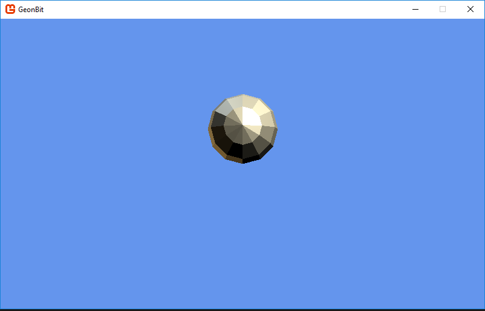

# GeonBit

**A 3D Entity-Component-System engine, powered by MonoGame for C# games.**

# Intro

GeonBit is an extensive Entity-Component based game engine, written in ```C#``` and powered by ```MonoGame```.


## What's ECS

From [Wikipedia](https://en.wikipedia.org/wiki/Entity%E2%80%93component%E2%80%93system):

> Entity-component system (ECS) is an architectural pattern that is mostly used in game development. 
> 
> An ECS follows the Composition over inheritance principle that allows greater flexibility in defining entities where every object in a game's scene is an entity (e.g. enemies, bullets, vehicles, etc.). 
> 
> Every Entity consists of one or more components which add additional behavior or functionality. Therefore, the behavior of an entity can be changed at runtime by adding or removing components. This eliminates the ambiguity problems of deep and wide inheritance hierarchies that are difficult to understand, maintain and extend. Common ECS approaches are highly compatible and often combined with data oriented design techniques.

Or in short, GeonBit provide a system of generic Game Objects to which you can attach / detach components. These are the building-blocks of your game.
In addition to the ECS system and framework, GeonBit also comes with a large set of built-in components, that make things like drawing, animating and physics a breeze.


## Key Features

In addition to its built-in ECS framework, *GeonBit* provide the following features / classes:


- UI
- - GeonBit.UI v3
- Managers
- - Application
- - ConfigStorage
- - Diagnostics
- - GameFiles
- - GameInput
- - Graphics
- - Plugins
- - Prototypes
- - Sounds
- - GameTime
- Graphics
- - Background
- - Skybox
- - Model
- - Skinned Model
- - Composite Model
- - Billboard
- - Sprite
- - Shapes
- Resources Manager
- Misc
- - TileMap
- - Editor Controller
- - Time To Live
- Particles System
- - CPU Particles
- - Animators
- Physics
- - Physical body with all basic shapes
- - Collision groups and filters
- - Ethereal objects
- - Static objects
- - Raytesting
- Sound
- - Sound effects
- - 3D sounds
- - Background music

In short, GeonBit comes with everything you need to implement a basic 3D game, fast and easy.

For more complicated stuff (for example, if you build a multiplayer game and need networking components), GeonBit is opened source easy to extend, so you can easily write your own components and integrate inside the existing ECS framework.


# Glossary

Before diving deeper into *GeonBit*, lets define some basic concepts (these are relevant to most ECS engines out there):

## GameObject

Game Objects are our main entities in the Engine. They are the ```Entities``` of the Entity-Component-System model. 
Every element of the game is implemented by a Game Object with components attached to it, from monsters to scripting and sound effects.

There is only one type of a *GameObject*, the difference between objects reside in the component types attached to them.
For example, if you want to place trees in your game, you'll probably create a *GameObject* with a 3D model of a tree + physical body attached to it.

Every *GameObject* have a list of child *GameObject*s, and a 3D scene node that represent its transformations in 3d space (eg position, rotation, scale etc).


## Components

*Components* are the logic pieces you attach to *GameObjects*, like a 3d model to render, a physicla body, sound effect to play, etc.

A *GameObject* without any components is just a node in the Scene, it has transformations and a 3D position and can hold children, but it doesn't do much without any *Components*.  To make a *GameObject* a meaningful part of your game, you attach *Components* to it.

Most components are independent and do not communicate with each other, but there are some exceptions that depeand on each other or even affect the transformations of the *GameObject* itself (for example, physics-related components often change the position & rotation of the *GameObject* containing them).

Note that *Components* are also the objects you will implement the most. For example, to create an AI to control your game monsters, you'll probably write some sort of an ```NPCs-Controller``` component and attach it to your monsters ```Game Objects```.


## SceneNode

Every *GameObject* has a scene node that represent its 3d transformations, eg position, scale, rotation, etc.
Unlike the *GameObject* that only has one type, there are many types of ```SceneNode```s that behave differently and are optimized for different purposes. We will cover those later.


## Prototypes

Since different objects in the game are made of *GameObject* with components attached to them, you probably want a way to define a game-specific type and create instances of it with all the components it needs. To do so, we use ```Prototypes```.

A ```Prototype``` is an instance of a *GameObject* you register to the ```Prototypes Manager``` and later you can create clones of it, or 'instanciate' it if you will.


## Scene

A ```Scene``` is a tree of *GameObjects* + some global settings, that represent a level or a 'screen' in your game. 

```Scenes``` can be easily loaded / unload to switch between levels and scenery.


# GeonBit Overview

This section provides a broad overview of the layers of *GeonBit*. It's arranged from top down, eg from the highest-level APIs to the lower-level "drivers".


## GeonBitMain

A singleton class that reside directly under the *GeonBit* namespace, and provide the main API to initialize and run the *GeonBit* engine.

You can use this class in two ways:

1. Implement a GeonBitGame class and call ```GeonBitMain.Instance.Run()``` to execute it.
2. Create your own *MonoGame* ```Game``` class, and call ```Initialize()```, ```Update()``` and ```Draw()``` manually (less recommended method).


## GeonBitGame

A class that replace *MonoGame*'s ```Game``` class and integrates with *GeonBit*.
You should inherit from this class to implement your game logic and use ```GeonBitMain.Run()``` to start the game main loop.


## Resources

Instead of the default *MonoGame* Content class, in *GeonBit* you use the Resources Manager. When implementing a custom component or GeonBitGame class, the resources manager is easily accessible via the ```Resources``` getter.


## GeonBit.Managers

The ```Managers``` layer is a collection of singleton classes, which provide API and utilities for things like input, game-time, diagnostics, physics, filesystem, etc.

These classes are accessible by the game components and scripts you write.


## GeonBit.UI

This layer contain a variety of UI elements you can create and use, and a main ```User Interface``` manager that runs the UI engine.

Note that ```GeonBit.UI``` is also released as an external independent library you can use for other ```MonoGame``` projects, even if they don't use *GeonBit*. More details [here](https://github.com/RonenNess/GeonBit.UI).


## GeonBit.ECS

The namespace that contains all the Entity-Component-System related classes. 
The basic *GameObject* class is implemented in this layer, as well the *GameScene* and all the *Components* you can attach to objects.


## GeonBit.Core

The ```Core``` layer provide the actual implementation of the different built-in components and engine components. 

For example, a component to render a 3D model will not deal with ```MonoGame``` models directly, but instead will use an object implemented in the ```Core``` layer that will do all the dirty work.
The ```Core``` layer also implements the integration with some third-party libraries, like the ```Bullet3D``` Physics engine.

While most of the ```Core``` classes are public and can be accessed by your game, usually its best to stick to the ```ECS``` layer and reduce ```Core``` usage to minumum. 


## External Libs

In addition to *MonoGame*, *GeonBit* uses some external libraries to implement different components of the engine, like ```Bullet3D``` for physics. 

These libs are used by the ```Core``` layer and you should not use them directly. Just know its there.


# Setup

There are 3 ways to setup *GeonBit*, listed below:

## From Template

*GeonBit* requires some external libs, specific init code, and built-in content.
Because of that, the best and most simple way to setup *GeonBit* is via the ```Visual Studio``` templates.

To do so, simply install the template file attached to this git ([found here](https://github.com/RonenNess/GeonBit/Template)) and create a new projects from that template. Your project should compile and run out of the box.

## From Empty Project

If you don't like to use templates for whatever reason, you can download a working empty *GeonBit* project from [this repo](https://github.com/RonenNess/GeonBit.Template).

Just clone the git and change project settings and name to fit your needs.

## Manual Setup

If you choose to setup *GeonBit* manually, for whatever reason, please follow these steps:

### Setup GeonBit.UI

First setup GeonBit.UI, which is the UI system that comes with *GeonBit*.
Its git and installation instructions can be found [here](https://github.com/RonenNess/GeonBit.UI).

### Setup GeonBit Core

After the UI is setup, install the *GeonBit* NuGet package with the following command:

```
Install-Package GeonBit.Core
```

This will also install the required dependencies.

Once the all the NuGet packages are successfully installed, follow these steps: 

1. Add all the Content that comes with the package (under the ```Content/GeonBit/``` folder).
2. Instead of implementing ```MonoGame``` 'Game' class, inherit and implement a ```GeonBit.GeonBitGame``` class, and implement the following functions:
    1. ```Draw()``` to add extra drawing logic.
    2. ```Update()``` to add extra update logic.
    3. ```Initialize()``` to create your scene and initialize stuff.
3. From your program's ```Main()``` function, Run *GeonBit* with your GeonBitGame class: ```GeonBitMain.Instance.Run(new MyGeonBitGame());```


# Using GeonBit

Now its time to finally learn how to use *GeonBit* to make your next awesome game!

## Game Objects & Components

As mentioned before, *GameObjects* are the basic entity in the Entity-Component model. Everything in your game is a *GameObject*.

Lets start by creating a new *GameObject*:

```cs
using GeonBit.ECS;
...

GameObject player = new GameObject("player", SceneNodeType.Simple);
```

The code above will create an empty *GameObject* called player, with a simple node type. We'll go over node types and their meaning later, but right now all you need to know is that a simple node type don't do any culling or optimizations, and is the best fit for objects you expect to always be visible.

Now lets add the player to the active scene and set its position:

```cs
player.Parent = ActiveScene.Root;
player.SceneNode.Position = new Vector3(0, 1, 0);
```

Run the game and... nothing happens. This is because setting up empty *GameObjects* won't really draw anything, unless we add some render components to them. So lets add a shape renderer to draw a sphere:

```cs
using GeonBit.ECS.Components.Graphics;
...

player.AddComponent(new ShapeRenderer(ShapeMeshes.SphereLowPoly));
```

Our full ```GeonBitGame``` code now look like this:

```cs
using Microsoft.Xna.Framework;
using GeonBit.ECS;
using GeonBit.ECS.Components.Graphics;

namespace GeonBitExamples
{
    /// <summary>
    /// Main for the game itself.
    /// </summary>
    public class MyGame : GeonBitGame
    {
        /// <summary>
        /// Create the game class.
        /// </summary>
        public MyGame()
        { 
			// optional settings:
			EnableVsync = true;
			DebugMode = true;
			UiTheme = "hd";
		}

        /// <summary>
        /// Override this to implement Update() function for your game to be called every frame.
        /// </summary>
        /// <param name="gameTime">Provides a snapshot of timing values.</param>
        override public void Update(GameTime gameTime)
        {
            // exit on escape
            if (Managers.GameInput.IsKeyDown(GeonBit.Input.GameKeys.Escape))
            {
                Exit();
            }
        }

        /// <summary>
        /// Override this to initialize game scenes and load data.
        /// </summary>
        override public void Initialize()
        {
		    // create player and add to scene
            GameObject player = new GameObject("player", SceneNodeType.Simple);
            player.Parent = ActiveScene.Root;
			
			// set position and add sphere component
            player.SceneNode.Position = new Vector3(0, 1, 0);
            player.AddComponent(new ShapeRenderer(ShapeMeshes.SphereLowPoly));
        }

        /// <summary>
        /// Override this to implement custom drawing logic.
        /// </summary>
        /// <param name="gameTime">Provides a snapshot of timing values.</param>
        override public void Draw(GameTime gameTime)
        {
        }
    }
}
```

And it should look like this:



Take your time and explore the different *Components* found under namespaces ```GeonBit.ECS.Components.*```. These are the basic tools that you use to build your game.


## Loading Resources

When using *GeonBit* you shouldn't access *MonoGame*'s ```ContentManager``` directly, but use *GeonBit*'s ```ResourcesManager``` instead.

To access the ```ResourcesManager``` from inside ```GeonBitGame``` or a custom ```Component```, simply use the ```Resources``` getter. Its API is fairly simple and staright forward.

For example, to get a model:

```cs
Model model = Resources.GetModel("path/to/model/file");
```

## Creating A Custom Component

The built-in *Components* cover basic generic things like rendering, sound, physics, etc. 
But they do not cover game-specific elements like monsters AI, player controllers, and aspects of your game logic itself. Those things are yours to make.

Lets start by creating a simple controller that will move our "player", the sphere from previous example:

```cs
/// <summary>
/// A component to move the sphere using the game controls.
/// </summary>
public class PlayerController : ECS.Components.BaseComponent
{
	/// <summary>
	/// Clone this component.
	/// </summary>
	/// <returns>Cloned PlayerController instance.</returns>
	public override ECS.Components.BaseComponent Clone()
	{
		return new PlayerController();
	}

	/// <summary>
	/// Do on-frame based update.
	/// </summary>
	protected override void OnUpdate()
	{
		// moving speed
		float movingSpeed = 10f;

		// Move up
		if (GameInput.IsKeyDown(Input.GameKeys.Forward))
		{
			_GameObject.SceneNode.PositionY += TimeManager.TimeFactor * movingSpeed;
		}
		// Move down
		if (GameInput.IsKeyDown(Input.GameKeys.Backward))
		{
			_GameObject.SceneNode.PositionY -= TimeManager.TimeFactor * movingSpeed;
		}
		// Move left
		if (GameInput.IsKeyDown(Input.GameKeys.Left))
		{
			_GameObject.SceneNode.PositionX -= TimeManager.TimeFactor * movingSpeed;
		}
		// Move right
		if (GameInput.IsKeyDown(Input.GameKeys.Right))
		{
			_GameObject.SceneNode.PositionX += TimeManager.TimeFactor * movingSpeed;
		}
	}
}
```

In the code above we defined a new *Component* type, called ```PlayerController```.

The first function, ```Clone()```, is something basic all *Components* must implement. It should return a copy of the *Component* itself.

The second function, ```OnUpdate()```, is the interesting part. This function as an event that will be called every frame, provided that the *GameObject* the component is attached to is currently alive and enabled (more on that later and the subject of events).

We use the ```GameInput``` manager to check if user pressed interesting keys. The ```GameInput``` manager is a high-level input helper that help us bind keyboard and mouse keys to abstract ```GameKeys```.

The default key settings are suitable for FPS games, and that's why we use ```GameKeys.Forward``` and ```GameKeys.Backward``` (which are bound to arrow up and down keys) instead of ```GameKeys.Up``` and ```GameKeys.Down```.

Next we see that when the right keys are pressed we change the position of ```_GameObject.SceneNode```. Inside a *Component* class, the ```_GameObject``` will always point on the parent *GameObject* the *Component* is attached too, so by moving this object the controller will move whatever *GameObject* it is currently attached to.

And one last fill to note is ```TimeManager.TimeFactor```. ```TimeManager``` is another manager class that help us manage game time and framerate independent movement and animations. By multiplying our movement with ```TimeManager.TimeFactor```, we guarantee that the sphere will move at the same speed regardless of FPS rate.

In real games we usually won't really move the player like that, but use a physical body instead (explained later), but right now for the simplicity of this tutorial we will move the sphere without any physics.

So now after making our controller all we are left to do is attach it to our *player*:

```cs
player.AddComponent(new PlayerController());
```

And voilà, pressing the arrow keys should now move the sphere around.

When implementing a *Component* there are many `events` we can use similar to ```OnUpdate()```. For example, we have a function to override that will be called when the object spawns or when it is destroyed, etc. We will cover the different events that a *Component* can respond to later in this doc.


## Component Events

As you seen before, every *Component* has the ```OnUpdate()``` event, which is called every frame. Component operate via a set of predefined events that trigger at different times, like when the component is added to a new parent, when its destroyed, etc.

To implement sophisticated components, its important to know the different events you can use.
The following is a list of all the built-in events and how they normally behave.

### OnSpawn

Triggers either when the scene loads, of when the *GameObject* containing the component is added to an already-spawned scene.

### OnDestroyed

Called when the *Component* is destroyed.

Note: simply removing from scene will not trigger this. It will only be triggered when the component is cleared from memory (eg collected by the GC) or if ```Destroy()``` is called.

### OnDisabled

Called when the *Component* or the *GameObject* containing it becomes disabled.

### OnEnabled

Called when the *Component* or the *GameObject* containing it becomes enabled, after it was disabled.

### OnUpdate

Triggers every frame on all objects, as part of the ```Update``` step. This is the place to put code that needs to execute every frame.

### OnBeforeDraw

Triggers on a *Component* before its parent *GameObject* is being rendered, but only if its currently visible (based on previous frame check). In other words, if a *GameObject* is scene node is currently culled out, it will not trigger this event.

### OnRemoveFromScene

Triggers when the *GameObject* containing the *Component* is removed from a scene. This event will trigger even if its not the currently active scene.

### OnAddToScene

Triggers when the *GameObject* containing the *Component* is added to a scene. This event will trigger even if its not the currently active scene.

### OnParentChange

Triggers whenever the *Component* is added or removed from a *GameObject*.

### OnCollisionStart

Triggers when one *GameObject* with a physical-body component collides with another *GameObject* with physical-body component.

Note: this event will trigger once per impact (when it starts), and will trigger on both colliding *GameObjects* components.

### CollisionEnd

Triggers when one *GameObject* with a physical-body component *stop colliding* with another *GameObject* with a physical-body component.

Note: this event will trigger once per impact (when it ends), and will trigger on both colliding *GameObjects* components.

### OnCollisionProcess

Triggers every physical frame while one *GameObject* with a physical-body component is touching another *GameObject* with a physical-body component.

Note: this event will trigger on both colliding *GameObjects* components.

### OnHeartbeat

An event that triggers every defined interval (set per *GameObject*), during the ```Update``` step.
Note: may trigger multiple times per frame, if interval is smaller than time between frames.

### OnFixedUpdate

Triggers every constant time interval on all objects, as part of the ```Update``` step. Unlike the similar ```OnUpdate``` event, the fixed update is FPS independent even if v-sync is disabled.

### OnReceiveMessage

Event that triggers programmatically, via the ```SendMessage()``` function. This provide a simple way for inter-components communication, even without knowing the other components currently attached to the *GameObject*.


## Built-In Components

The following is an abridged list of the most important built-in components *GeonBit* have to offer, and when to use them. For the full list of *Components* and their API, please revise the docs or explore the ```GeonBit.ECS.Components``` namespace via code.


### Graphics

The following is a list with few of the built-in graphic-related components:

#### Camera

Create a camera object, eg point-of-view of the player. There can be only one active camera at-a-time, and scenes without camera will not render anything.

```cs
gameObject.AddComponent(new Camera());
```

#### ModelRenderer

Render a simple 3d model.

Usage example:

```cs
gameObject.AddComponent(new ModelRenderer("asset_path"));
```

#### ShapeRenderer

Render a 3d shape from a set of predefined models.

Usage example:

```cs
gameObject.AddComponent(new ShapeRenderer(ShapeMeshes.Cube));
```

#### SkinnedModelRenderer

Render a 3d model with skinned animation (be sure to set the content importer to GeonBit skinned animation).

Usage example:

```cs
gameObject.AddComponent(new SkinnedModelRenderer("asset_path"));
```

#### BillboardRenderer

Render a texture that always faces camera.

Usage example:

```cs
gameObject.AddComponent(new BillboardRenderer("asset_path"));
```

#### Sprite

Just like BillboardRenderer, but support spritesheet based animation (eg changing UV coords at runtime to play different animations).

This component is a fit for a 2.5D games (like Doom, Duke3d, etc.) where enemies are animated sprites in 3D space.

Usage example:

```cs
// create spritesheet data for a spritesheet containing 4 rows and 8 columns.
var spritesheet = new SpriteSheet(new Point(8, 4));

// create a sprite that uses the spritesheet data above, with "texture_path" as texture.
gameObject.AddComponent(new Sprite(spritesheet, "texture_path"));
```


#### SkyBox

Render a 3D skybox with skybox texture.

Usage example:

```cs
gameObject.AddComponent(new SkyBox("texture_path"));

// OR

Managers.GraphicsManager.CreateSkybox("texture_path", scene.Root);
```


### Physics

The following is a list with few of the built-in physics-related components:

#### PhysicalBody

A physical body that attaches to a game object and controls its transformations (position & rotation).

Usage example:

```cs
PhysicalBody playerPhysics = new PhysicalBody(new BoxInfo(bodySize), inertia: 0f);
playerPhysics.SetDamping(0.95f, 0.95f);
playerPhysics.Gravity = Vector3.Down;
playerPhysics.CollisionGroup = (short)CollisionGroups.Player;
playerGameObject.AddComponent(playerPhysics); 
```


### Sound

The following is a list with few of the built-in sounds-related components:

#### BackgroundMusic

Plays background music from a media file (note: can only have 1 active background music playing at a time).

Usage example:

```cs
gameObject.AddComponent(new BackgroundMusic("song_file_path"));
```


#### SoundEffect

Plays a sound effect (can be a 3d sound).

Usage example:

```cs
gameObject.AddComponent(new SoundEffect("sound_file_path"));
```


### Misc

The following is a list with some of the built-in misc components you should know:

#### CameraEditorController

Attach keyboard & mouse controller to a GameObject that implements editor-like controls. Be sure to attach this to the *GameObject* with the scene active camera.

This object is great for debug and development process.

Usage example:

```cs
gameObject.AddComponent(new CameraEditorController());
```

#### TimeToLive

A very cruel timer that destroy its owner after X seconds. Use this for objects you want to appear only for a known period of time.

Usage example:

```cs
gameObject.AddComponent(new TimeToLive(5.0f));
```

#### TileMap

Helper component to create and manage a 3D tiles map.

Usage example:

```cs
// create tilemap and add to a game object
var tilemap = new TileMap(tileSize);
gameObject.AddComponent(tilemap);

// get a tile from the tilemap (this will also create it if don't exist yet)
GameObject tile = tilemap.GetTile(index);
```

#### ParticleSystem

A component that spawns multiple particles based on a set of rules. Use this to create effects like fire, smoke, etc.

Usage example:

```cs
using GeonBit.ECS.Components.Particles;
using GeonBit.ECS.Components.Particles.Animators;
...

// define the particle prototype and add some animators to it
GameObject particle = new GameObject("particle", SceneNodeType.ParticlesNode);
ShapeRenderer shape = particle.AddComponent(new ShapeRenderer(ShapeMeshes.Sphere), "model") as ShapeRenderer;
shape.RenderingQueue = Core.Graphics.RenderingQueue.Effects;
particle.AddComponent(new TimeToLive(3f));
particle.AddComponent(new FadeAnimator(BaseAnimatorProperties.Defaults, 1f, 0f, 2.5f, 0.5f));
particle.AddComponent(new MotionAnimator(BaseAnimatorProperties.Defaults, Vector3.Up * 25f, acceleration: Vector3.Down * 15f, velocityDirectionJitter: Vector3.One * 5));
particle.AddComponent(new ScaleAnimator(BaseAnimatorProperties.Defaults, 0.5f, 1.5f, 4f, 0.5f, 0.5f, 0.5f));
particle.AddComponent(new ColorAnimator(BaseAnimatorProperties.Defaults, Color.Red, Color.Orange, 3f));

// create particles system
GameObject systemObject = new GameObject("system1", SceneNodeType.Simple);
ParticleSystem system = systemObject.AddComponent(new ParticleSystem()) as ParticleSystem;
system.AddParticleType(new ParticleType(particle, frequency: 0.85f));
systemObject.Parent = scene.Root;
```

Note that in the example above we use animator components from ```GeonBit.ECS.Components.Particles.Animators``` namespace. 
While we're not going to cover them in this doc, its recommended to take a look at the different animators that come with *GeonBit*. You might find some of them useful, even outside of a particles system.


## Scenes

As mentioned before, a *GameScene* wraps a tree of *GameObjects*, and usually represent a stage, level, or a screen in your game. 

By default, *GeonBit* creates and load an empty scene with a single camera, so you can easily place and see entities without any preperation code. However, its always recommended to create your own scene (or load one from a file) rather than using the default scene.

### Creating a Scene

Creating a scene is easy:

```cs
using GeonBit.ECS;
...

// create a new empty scene
GameScene scene = new GameScene();
```

One created, you can start adding objects to its root:

```cs
// add a game object to the new scene
someObject.Parent = scene.Root;
```

The *root* object of the scene is an empty *GameObject* to you can place your objects under. 
Everything under this *GameObject* will be considered a part of this scene.

### Loading Scene

To load the scene (eg make it the currently active scene), use the ```Load()``` function:

```cs
scene.Load();
```

Note that this action will unload the currently active scene and replace it with the new scene, which means all the non-persistent data of the previous scene will be lost.

Once loaded, the scene will trigger ```OnSpawn``` events to its children.


## Managers

Managers in *GeonBit* are singleton classes that provide utilities and access API for a certain aspect of the game. 

While inside a ```GeonBitGame``` or a ```Component``` scope, there's a shortcut for all the built-in Managers via the ```Managers``` instance. 
For example, if you want to access the *Sound* Manager from inside a component:

```cs
Managers.SoundManager.PlayMusic("my_jam");
```

If you are outside of ```GeonBitGame``` or a component scope, you can still access managers via their instance getter:

```cs
GeonBit.Managers.SoundManager.Instance.PlayMusic("my_jam");
```

The following is a list of all the main Managers you should know in *GeonBit*:


### Application

Provide application-level functions as well as the currently active scene.
Via this manager you can do things like loading scenes, exit the game, etc.

Usage example:

```cs
// exit the game
Managers.Application.Exit();
```


### GameInput

Provide API to get game input and bind keyboard and mouse keys to logical 'game keys'.
For example, you can use this manager to set that bot ```Space``` key or ```Left mouse button``` will mean 'fire', and then test if player hit ```fire``` key:

```cs
if (Managers.GameInput.IsKeyDown(GeonBit.Input.GameKeys.Fire))
{
    // fire your weapon!
}
```

In addition, it provides an API to save and load control settings, and switch between a set of pre-defined commonly used layouts.


### GraphicsManager

Provide graphic-related utilities.


Usage example:

```cs
// create a GameObject with background component attached to it, loaded from 'background_image'.
// note: you can easily do this manually by creating a new GameObject and adding the component yourself, this helper function just saves you some code.
GameObject background = Managers.GraphicsManager.CreateBackground("background_image", scene.Root);
```


### SoundManager

Provide sound-related utilities.


Usage example:

```cs
// play back_music, on repeat and 0.75 volume.
// note: you can also create a GameObject and attach background music component to it if you want the back music to be attached to the scene.
Managers.SoundManager.PlayMusic("back_music", true, 0.75f);
```


### TimeManager

Manage in-game time. This manager helps you keep track on your game time, but more importantly, provide a time factor to multiply things to keep them FPS independant.

For example, if you want to move a model by 50 units in game seconds*, you can multiply its movement with the time factor.

Usage example:

```cs
// move object 'go' in an fps-independant way, based on game time
go.SceneNode.PositionX += speed * Managers.TimeManager.TimeFactor;
```

Note that by default ```game time == real time```. In other words, one second in real life means one second in game time. However, you can change that by playing with the game time factor:

```cs
// this will make 1 second in real world equals to 2 seconds in game time.
Managers.TimeManager.TimeSpeed = 2f;
```


### GameFiles

A think wrapper for writing and reading serializeable objects from files located in a special `game` folder.
If you want to dynamically read and write game files, use this manager.


Usage example:

```cs
// write someObject to a game-file
Managers.GameFiles.WriteToFile(FileFormats.Binary, "filename", someObject);
```


### ConfigStorage

Provide simple API to store config-related data on disk (player preferences etc).
Note: usese ```GameFiles``` manager internally.

Usage example:

```cs
// put config on disk (some_value can be any serializeable object or string)
Managers.ConfigStorage.Set("config_key", some_value);

// get config from disk
var config = Managers.ConfigStorage.Get<SomeType>("config_key");
```


### Diagnostic

Provide diagnostic and debug data.


Usage example:

```cs
// get full report string
string report = Managers.Diagnostic.GetReportString();
```


### Prototypes

Its reasonable to want to instantiate a specific *GameObject* multiple times. 

For example, you might want to create a *GameObject* that represent an enemy type, and clone it several times for different locations of your level (assuming your game have more than one enemy in it..).

One way to do it is simply creating the enemy *GameObject* once and use the ```Clone()``` method to duplicate it multiple times. Another way would be writing a function that build a new enemy *GameObject* from scratch (not recommended).

But the best way is to use Prototypes.

Prototypes manager is a relatively simple object that let you store *GameObject* instances and later reuse them from anywhere in your game.

For example, after creating your enemy *GameObject* and adding all its components, you can register it to the Prototypes bank:

```cs
Managers.Prototypes.Register(enemyGameObject, "enemy");
```

And whenever you want to spawn a new enemy instance, you can fetch it from Prototypes:

```cs
GameObject newEnemy = Managers.Prototypes.Spawn("enemy");
```

Using Prototypes to instantiate *GameObject* types is recommended for both readability and to enjoy internal optimizations that might be added to *GeonBit* at later versions.


## UI

As mentioned before, *GeonBit* comes with its own UI system, called *GeonBit.UI*. You can find *GeonBit.UI* full docs [here](https://github.com/RonenNess/GeonBit.UI). 

In this chapter we'll only go through on how *GeonBit.UI* is integrated inside *GeonBit*.

### Scene.UserInterface

Every *GeonBit* scene comes with its own UserInterface manager. 
Whenever you load a scene, its UI will also load and becomes the active UI, also accessible as ```GeonBit.UI.UserInterface.Active```.

Its important to remember that when changing UI cursor, scale, etc. you are actually affecting the UI of the currently active scene, and switching scenes might override those changes.

You don't need to worry about calling ```UserInterface.Draw()``` or ```UserInterface.Update()```, *GeonBit* does that automatically.

### Quick Example

Here's a quick example on how to add a basic panel with some entities to a scene's UI:

```cs
// create a panel and position it in center of screen
Panel panel = new Panel(new Vector2(400, 400), PanelSkin.Default, Anchor.Center);

// add to the scene's UI
scene.UserInterface.AddEntity(panel);

// add title and text
panel.AddChild(new Header("Example Panel"));
panel.AddChild(new HorizontalLine());
panel.AddChild(new Paragraph("This is a simple panel with a button."));

// add a button at the bottom
panel.AddChild(new Button("Click Me!", ButtonSkin.Default, Anchor.BottomCenter));
```

Whenever the scene is loaded, you should see something like this:


### Copying and Creating new UIs

If you want multiple scenes to share the same UI, you can simple copy the UI from one scene to another:

```cs
// copy the UI from scene2 into scene 1:
scene1.UserInterface = scene2.UserInterface;
```

Or to create a new empty UI:

```cs
// create a new, empty UI for scene1:
scene1.UserInterface = new GeonBit.UI.UserInterface();
```


# Advanced Topics

This chapter dives deeper into *GeonBit*, and contains useful information about some of the inner works and optimizations. 

While this might sound like an optional nice-to-have reading, its actually quite critical for most projects. 


## Scene Nodes & Culling

A *SceneNode* is the part of the *GameObject* that represent its 3D transformations and position. Every *GameObject* holds a single *SceneNode*, and when you scale or move a *GameObject*, you actually transform its *SceneNode*.

While there's only one type of generic *GameObject* you can use, there are different types of *SceneNodes* that are optimized for different purposes. 
Knowing the different *SceneNode* types can be crucial to performance.

The following is a list of the main *SceneNodes* you should know, and when to use them.

### Simple

*Simple* is the most basic (and default) scene node type, that don't do any culling or optimizations. Use this type for objects that are always visible.
For example, if you build an FPS game and make a *GameObject* to render the weapon your character is holding, its best to use a *Simple* node for the weapon *GameObject* as it will always be visible and should never be optimized or culled.

To create a *GameObject* with *Simple* node type:

```cs
// create a new Game Object with simple scene node.
GameObject newObj = new GameObject("go_name", SceneNodeType.Simple);
```

### BoundingBoxCulling

*BoundingBoxCulling* is a scene node that calculates its bounding box (including its child nodes), and cull out when outside the camera [view frustum](https://en.wikipedia.org/wiki/Viewing_frustum).

You should use this type of node for large models that fit nicely inside a box, and may be off screen at least part of the time. 
Note however that calculating the bounding box adds some overhead of its own, so its not a good option for large quantity of constantly moving objects.

Its also important to mention that drawing happens recursively, eg a scene node will first test and draw itself, then its children, they will draw their children, and so forth.
You can take advantage of that to divide your scene in a more optimal way and gain better performance from culling.
 
For example, if you have a *GameObject* that represents a room and there are lots of furnichairs inside of it, making the furnichairs *GameObjects* children of the room *GameObjects* (in opposite to just putting them all under scene root) will actually make culling a lot faster, especially when the entire room is hidden and can skip the culling tests of its children completely.
In general, its always recommended to build your scene in a logical way, especially for static objects that cannot move.

To create a *GameObject* with *BoundingBoxCulling* node type:

```cs
// create a new Game Object with box-culling scene node.
GameObject newObj = new GameObject("go_name", SceneNodeType.BoundingBoxCulling);
```

### BoundingSphereCulling

*BoundingSphereCulling* is just like ```BoundingBoxCulling```, but uses a bounding sphere instead of a box.

The main difference is that a bounding sphere is easier to create and test against the camera frustum, and it may be more fittin for different type of models.

To create a *GameObject* with *BoundingSphereCulling* node type:

```cs
// create a new Game Object with sphere-culling scene node.
GameObject newObj = new GameObject("go_name", SceneNodeType.BoundingSphereCulling);
```

### ParticlesNode

*ParticlesNode* is a special scene node optimized for CPU-based particles. We will cover particles later, for now just know it exists.

You should use this node type for when you have lots of small, constantly moving objects that shift in and out of screen.

To create a *GameObject* with *ParticlesNode* node type:

```cs
// create a new Game Object with particles scene node.
GameObject newObj = new GameObject("go_name", SceneNodeType.ParticlesNode);
```

### OctreeCulling

*OctreeCulling* node is perhaps the most important node type to know, that can make the greatest impact on your game performance.

An [Octree](https://en.wikipedia.org/wiki/Octree) is basically a tree where every node has exactly 8 children. In computer graphics, every Octree node is a bounding-box divided into 8 smaller boxes, with half its parent width, height and length.
Octree culling use this structure to 'divide and conquer' the scene. First we break the entire level into 8 and test each section bounding box with camera frustum. Only the parts that are visible will then check its 8 children, and so forth, until reaching a minimal bounding box size and iterate its entities.

Needless to say, the Octree node does not create all nodes upfront as it is wasteful to memory; It dynamically creates and remove nodes as needed.

An Octree node is best for large, static levels containing lots of models that don't transform. Its less optimal for massive amount of rapidly moving objects (although still better than other methods) and for very large objects that can't fit in the smaller bounding boxes.
Its also important to note that the octree node has a limited size and objects that reside outside of it will not be culled properly.

Octrees are very complicated subject and its recommended to read more about it on different online resources.

To create a *GameObject* with *OctreeCulling* node type:

```cs
// create a new Game Object with octree scene node with default settings.
GameObject newObj = new GameObject("go_name", SceneNodeType.OctreeCulling);

// OR: create a new Game Object with octree scene node and custom properties
GameObject newObj = GameObject.CreateOctree(origin, size, maxDivisions);
```


[An octree example with bounding-boxes rendered. Yellow boxes are segments that contain entities.]

## Rendering Queues

If you tried drawing multiple 3D objects with opacity before reading this chapter, you probably noticed a weird phenomenal; they sometimes hide each other as if they were solid, eg the background object is not seen at all instead of merging with the front transparent object.

The reason for that is because if you write half-transparent pixels to the depth buffer, they later hide background pixels completely instead of merging with them.

Luckily for us, this problem is easily solved via [transparency sorting](https://www.khronos.org/opengl/wiki/Transparency_Sorting) and disabling the depth buffer. However, applying these techniques on solid, plain objects will be a terrible waste of optimizations.

So in order to satisfy the needs of different graphical objects, *GeonBit* uses a set of different ```rendering queues```.

Every rendering queue has its time in the rendering process, and different rendering queues treat things like depth buffer, sorting, and face culling differently.

You can set on which queue to draw every graphical component via the ```RenderingQueue``` property:

```cs
explosion.RenderingQueue = RenderingQueue.EffectsUnordered;
```

There are lots of built-in rendering queues in *GeonBit* designed for different purposes, to know them all check out the docs on the ```RenderingQueue``` enum.


## Materials

A material is an object that describes how to render a given surface. 
Materials are made of an Effect (eg shaders) and some extra data (diffuse color, specular, sampling mode, etc..).

*GeonBit* provide 5 basic Materials you can use:

#### BasicMaterial

Render smooth surfaces with constant basic lights. This material uses MonoGame ```BasicEffect```.

#### AlphaTestMaterial

A material that performance alpha test and omit invisible pixels. This material uses MonoGame ```AlphaTestEffect```.

#### SkinnedMaterial

A material that support GPU skinned animation. This material uses MonoGame ```SkinnedEffect```.

#### SkyboxMaterial

A special material used to render skybox (and potentially skydome, if you implement one). This material uses MonoGame ```BasicEffect```, without lighting and with constrant world matrix.

#### SpriteMaterial

A material used to render sprites and billboards. This material uses MonoGame ```AlphaTestEffect```.


### Materials Mapping

Whenever *GeonBit* loads a 3d model, it will generate materials to fit its effect (as defined in the content manager).
For example, if you have a model loaded with ```BasicEffect```, *GeonBit* will create a ```BasicMaterial``` to use with this model.

You can change which materials are assigned to which effects using the ```DefaultMaterialsFactory``` static class:

```cs
using GeonBit.Core.Graphics.Materials;
..

// change how we create material for basic effects
DefaultMaterialsFactory.SetDefaultMaterialGenerator(MaterialTypes.Basic, (Effect mgEffect) => 
    {
        return new MyCustomMaterial((BasicEffect)mgEffect, true);
    }
);
```

As you can see from the code above, the ```DefaultMaterialsFactory``` is a static class that hold a function to generate materials for different effect types. 
When loading a new model, those generation functions will be called.

Since the materials that come with *GeonBit* are very basic and limited, normally you would want to create your own material types and assign them to the default effect types.


### Create Custom Materials

To create your own material you need to inherit from the MaterialAPI class:

```cs
/// <summary>
/// A custom material type.
/// </summary>
public class MyCustomMaterial : MaterialAPI
{
    // the effect instance of this material.
    BasicEffect _effect;

    /// <summary>
    /// Get the effect instance.
    /// </summary>
    public override Effect Effect { get { return _effect; } }

    /// <summary>
    /// Create the custom material from empty effect.
    /// </summary>
    public MyCustomMaterial() : this(new BasicEffect(GraphicsManager.GraphicsDevice), true)
    {
    }

    /// <summary>
    /// Create the custom material.
    /// </summary>
    /// <param name="effect">Effect to use.</param>
    public MyCustomMaterial(BasicEffect effect)
    {
        _effect = effect;
    }

    /// <summary>
    /// Apply this material.
    /// </summary>
    override protected void MaterialSpecificApply(bool wasLastMaterial)
    {
        // set world matrix
        _effect.World = World;

        // if it was last material used, stop here - no need for the following settings
        if (wasLastMaterial) { return; }

        // set all effect params
        _effect.View = View;
        _effect.Projection = Projection;
        _effect.Texture = Texture;
        _effect.TextureEnabled = TextureEnabled;
        _effect.Alpha = Alpha;
        _effect.AmbientLightColor = AmbientLight.ToVector3();
        _effect.DiffuseColor = DiffuseColor.ToVector3();
        _effect.LightingEnabled = LightingEnabled;
        _effect.PreferPerPixelLighting = SmoothLighting;
        _effect.SpecularColor = SpecularColor.ToVector3();
        _effect.SpecularPower = SpecularPower;
        GraphicsManager.GraphicsDevice.SamplerStates[0] = SamplerState;
    }

    /// <summary>
    /// Clone this material.
    /// </summary>
    /// <returns>Copy of this material.</returns>
    public override MaterialAPI Clone()
    {
        MaterialAPI ret = new MyCustomMaterial(_effect);
        CloneBasics(ref ret);
        return ret;
    }
}
```

As you can see the implementation is pretty simple:

- You need a constructor that get an Effect type and store it (it can be one of the basic effects or your own effect implementation).
- Effect getter is something you must implement that returns the effect instance.
- MaterialSpecificApply() is the function that's called when you need to use this effect. This is the time to copy the material properties into the effect (check out all the basic properties in MaterialAPI or define your own properties).
- Clone() is a function you must implement to create a copy of this material.

That's it. The tricky part here is to implement the Effect itself, which is outside of *GeonBit*'s scope.


## Physics

The physics simulation in *GeonBit* uses the open-source Bullet3D library. Physics in *GeonBit* includes:

- Rigid bodies.
- Collision detection and ray casting.
- Prevent penetration of solid objects.

This chapter will explain how to use GeonBit physics.


### The PhysicalBody Component

A *PhysicalBody* is an entity that creates a rigid body and attach it to a *GameObject*. 
Once a PhysicalBody is attached to an object, the object's position and rotation will be controlled by the physical body.

Lets see a basic example of how to add a physical body to an object:

```cs
// create a physical body component with a box shape (sized 10x10x10). note: inertia 0 will prevent rotation
PhysicalBody body = new PhysicalBody(new BoxInfo(new Vector3(10,10,10), mass: 10f, inertia: 0f);
go.AddComponent(body);
```

#### Static Bodies

Static bodies are physical bodies that cannot be moved (like walls, floor, trees, etc.). To create a static body, you simply need to set its mass to 0:

```cs
// create a static physical body in the shape of a box
PhysicalBody body = new PhysicalBody(new BoxInfo(new Vector3(10,10,10), mass: 0f, inertia: 0f);
```

#### Collision Groups

Collision groups allow you to control which objects can collide with which objects.
For example, in your game you might decide that enemy bullets will not hit other enemies and just go through them. In other words, you might want to decide that enemy bullets only collide with player and static objects (walls etc).

To do so, you use collision groups and masks.

- Collision Group is a short you assign to bodies that identify their "type".
- Collision Mask is a short you assign to bodies that control with which other bodies it may collide.

When two bodies collide, the physics simulator will do an ```AND``` operator between the collision group of one body and the mask of the other, and if the result is not 0, they will collide.
This means that a body can be in multiple collision groups and all it takes is one match to make a collision.

Given the example with the enemy bullets above, lets show an example of how to set a collision group for the bullets:

```cs
bulletBody.CollisionGroup = CollisionGroups.EnemyProjectiles;
```

The enum* ```CollisionGroups``` provide a set of predefined collision groups commonly used in games. 
You don't have to use them though, you can define your own set of collision groups and use whatever you like. They are there only for your convenience.

Now lets make sure the bullets can't collide with enemies:

```cs
short bulletMask = CollisionGroups.OR(CollisionMasks.NonCharacterTargets, CollisionGroups.Player);
bulletBody.CollisionMask = bulletMask;
```

So what did we do in the lines above? First, we defined a collision mask for the bullet, composed of ```CollisionMasks.NonCharacterTargets``` and ```CollisionGroups.Player``` collision groups.

- *CollisionMasks.NonCharacterTargets* is a pre-defined set of collision groups that contain all the possible targets, except for characters.
- *CollisionGroups.Player* is the collision group we'll use for the player's body.

Note that *CollisionMasks* contains a set of useful masks you can use that cover most of basic use cases. And like with the default collision groups, you can also write your own masks and ignore what *GeonBit* offers by default.

Now we just need to set the players body collision group:

```cs
playerBody.CollisionGroup = CollisionGroups.Player;
```

And when setting the enemies collision mask, you might want to make sure you don't add *CollisionGroups.EnemyProjectiles* to the bunch.


### Collision Callbacks

If you want to respond to collsion between objects, you need to attach a component to one or more of the bodies that listens to one of the collision callbacks:

- OnCollisionStart will be called once when two bodies begin colliding.
- OnCollisionEnd will be called once when two bodies stop colliding.
- OnCollisionProcess will be called every frame while the bodies are still colliding.

For example, the following component will act as a 'killer' body - everything that touch it dies immediately:

```cs
/// <summary>
/// Called when the parent Game Object start colliding with another object.
/// </summary>
/// <param name="other">The other object we collide with.</param>
/// <param name="data">Extra collision data.</param>
protected override void OnCollisionStart(GameObject other, Core.Physics.CollisionData data)
{
    other.Destroy();
}
```


### Ethereal Bodies

Sometimes you want to use collision detection to respond with a callback, but you don't want the body to block other bodies.
For example, you might want to create a fire that damage the player whenever he stands on it. You want to create a physical body for the fire and respond to collision, but you don't want the fire to block the player from walking through it.

For that purpose you can set bodies as `Ethereal`.
Ethereal bodies will still invoke collision callbacks, but will not block other bodies. To make a physical body ethereal:

```cs
body.IsEthereal = true;
```

### Physical World

You can access the physical world of a scene via ```scene.Physics```. 
The physical world is the object containing all the physical bodies of a scene, and manage stuff like default gravity etc.

For example, the following code will set the default gravity of a scene:

```cs
scene.Physics.SetGravity(new Vector3(0, -50, 0));
```

### Raycasting

In this context, raycasting refers to the ability to send forward a ray and return all the physical bodies it collides with.

To make ray casting to get the nearest object:

```cs
// do raycast from origin point (Vector3.Zero) to 100 units forward, and return only one result: the nearest object hit.
Core.Physics.RaycastResults raycast = scene.Physics.Raycast(Vector3.Zero, Vector3.UnitZ * 100, returnNearest: true);

// if we hit anything, we destroy that object
if (raycast.HasHit)
{
    raycast.Collision.CollisionBody._GameObject.Destroy();
}
```

Or if you want to make a raycast that returns all objects in its path:

```cs
// do raycast from origin point (Vector3.Zero) to 100 units forward, and return anything it hits.
Core.Physics.RaycastResults raycast = scene.Physics.Raycast(Vector3.Zero, Vector3.UnitZ * 100, returnNearest: false);

// if we hit anything, we destroy those objects
if (raycast.HasHit)
{
    foreach (var collision in raycast.Collisions)
    {
        collision.CollisionBody._GameObject.Destroy();
    }
}
```

And of course sometimes you want to send a ray from a specific object (for example you send a ray from the player to see what did it hit) so you want the raytest to ignore that object.

To add a 'self' object to ignore:

```cs
// raycast while ignoring 'objectToIgnore' (will return single nearest result)
Core.Physics.RaycastResults raycast = scene.Physics.Raycast(Vector3.Zero, Vector3.UnitZ * 100, objectToIgnore);
```

### Sound Effects

There are 3 types of sounds you can play in your game:

- Background music.
- Sound effect.
- 3D sound effect.

In this chapter we'll quickly go over and explain these options.

#### Background Music

There can be only one playing music at a time. Also note that the background music plays via the Media Player, which means on some consoles you can silence it or override with different songs.

To play background mustic you can use the sound manager:

```cs
// play 'background_music' in repeat mode at volume 0.75. note that 'background_music' asset type should be 'Song'.
Managers.SoundManager.PlayMusic("background_music", true, 0.75f);
```

Or you can create a GameObject with background music component (useful if you want to attach the music to a specific scene):

```cs
using GeonBit.ECS.Components.Sound;
...

// create a gameobject with background music and add to scene
GameObject backMusicGo = new GameObject("background_music");
backMusicGo.AddComponent(new BackgroundMusic("song_name"));
backMusicGo.Parent = scene.Root;
```

#### Sound Effect

Sound effects are components you can attach to Game Object, that play sound effect in repeat or when triggered:

```cs
using GeonBit.ECS.Components.Sound;
...

// create a sound effect that plays when spawn and attach it to a gameobject
SoundEffect spawnSound = new SoundEffect("sound_effect_file");
spawnSound.PlayOnSpawn = true;
gameObject.AddComponent(spawnSound);
```

In the example above, the moment 'gameObject' spawns it will also play the sound effect, once.


#### 3D Sound Effect

3D sounds are sound effects that have emitting source and a listener object, and they change their properties (like volume etc) based on distance and position of the points.

To make a sound effect 3D:

```cs
soundEffect.Enable3D();
```

And then you can set its fading factor, like this:

```cs
soundEffect.DistanceFadeFactor = 0.1f;
```

Note that by default the Listener object is the active camera. However, if you want to use another listener, you can set the following:

```cs
soundEffect.UseCameraAsListener = false;
soundEffect.Listener = someGameObject;
```

Setting alternative listeners which are not the camera is useful for top-down games, where the camera is far away from the player but you want the sound to be based on player's position.

In addition to setting a Listener manually per-sound effect, you can also set a global default listener, that all effects that have no Listener will use:

```cs
SoundEffect.DefaultListener = listenerGameObject;
```


# Cookbook

In previous chapters we learned about the different classes of *GeonBit* and what the engine has to offer. 
In this chapter we'll go throught a set of coding examples to show how to do basic and common things required for different game styles.

This is a basic how-to collection with *GeonBit*.


## Create Animated Sprites

TBD

## Use Skinned Models

TBD

## Backgrounds and Skybox

TBD

## Create Player Controls

TBD

## Make Isometric Game

TBD

## Make FPS Game

TBD

## Make Top Down Game

TBD


# Plugins

Its very common to define your own Component types and custom Managers in GeonBit, and even more common to want to reuse or share them with other people.
The best way to do it is to create Plugins.

You can create custom a plugin by making a dll that reference ```GeonBit.Core``` and implements a special class called ```GeonBitPluginInitializer```, which will be described shortly.
Inside your custom plugin you can define any number of Components, Managers, and other cool Utils, and adding plugins to GeonBit is simply a matter of referencing the plugin's dll.

## Core Plugins

The following is a list of GeonBit core plugins that ship separately and you can easily add to your GeonBit projects:

- LuaScript: plugin that add support in dynamically-loaded Lua scripts (via MoonSharp). TBD
- CSharpScript: plugin that add support in dynamically-loaded C# scripts (via Roslyn). TBD


## GeonBitPluginInitializer

To make your plugin recognized by *GeonBit*, define anywhere in your assembly a public class called ```GeonBitPluginInitializer```, that implements the following *public* static functions:

#### GetName()

Should return your plugin's name.

#### Initialize()

Called when your plugin is loaded by GeonBit.

### Example

Here's an example of a basic ```GeonBitPluginInitializer``` class and how it should look like:

```cs
public static class GeonBitPluginInitializer
{
    // get plugin name
    static public string GetName() 
    {
        return "MyPlugin";
    }
    
    // initialize plugin
    static public void Initialize()
    {
        // do init code
    }
}
```

Or, you can fetch a *GeonBit* plugin template from [here](https://github.com/RonenNess/GeonBit/PluginTemplate).

Note that you can define a dll with custom Components etc without making that special class and it will still be usable, but in this case GeonBit won't know this plugin is loaded and you will have to initialize your Managers and other stuff manually.
Its also a good practice to make your dlls a proper GeonBit plugins for whatever future features GeonBit might add for plugins.

## Creating Plugin Components

To create a custom component, simply inherit from the ```GeonBit.ECS.Components.BaseComponent``` class and implement the required functions.
Its recommended to put all your plugin Component classes under ```GeonBit.ECS.Components.<PluginName>``` namespace, to avoid collision with other plugins or future core features.

Your custom components may access any core components, utilities and other built-ins GeonBit provides.

## Creating Plugin Managers

To create a custom manager, simply inherit from the ```GeonBit.Managers.IManager``` interface and implement the required functions.
Note that all managers must be registered into GeonBitMain prior Initialization, using the following API:

```cs
// managerInstance is an instance of your manager class.
GeonBit.GeonBitMain.RegisterManager(managerInstance);
```

To do so please use the ```GeonBitPluginInitializer``` Initialize() function.


# Misc

## TBDS

- GPU particles system.
- Spritesheet animation clips.
- More built-in materials, including with real lights.
- Physical material - maybe?

## Credits

- Kastellanos Nikolaos for Skinned Model animations (https://github.com/tainicom/Aether.Extras).
