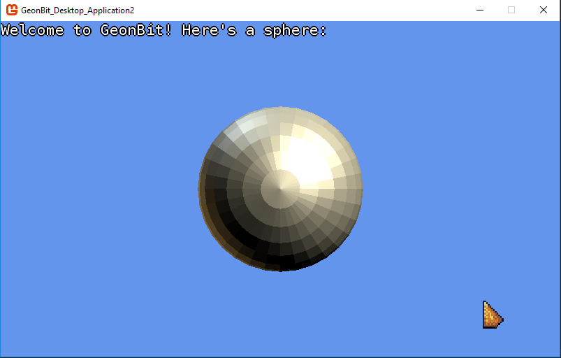

# Setup

There are 2 ways to setup *GeonBit*, from template or manually:

## From Template

*GeonBit* requires some unique init code and built-in content. 
Because of that, the best way to setup *GeonBit* is to use the provided ```Visual Studio``` template.

To use GeonBit template, follow these steps:

1. Download template [from here](https://github.com/RonenNess/GeonBit/raw/master/Template/GeonBit%20Desktop%20Application.zip) (or take the zip file from ```Template/``` folder).
2. Install it on Visual Studio (most simple way is to copy it to VS templates folder, for example: ```C:\Users\<USERNAME>\Documents\Visual Studio 2015\Templates\ProjectTemplates```).
3. Create a new project from the GeonBit template.

When executing the new project, you should see something like this:




## Manual Setup

If you choose to setup *GeonBit* manually please follow these steps:

### Setup GeonBit.UI

First setup GeonBit.UI, which is the UI system that comes with *GeonBit*.
Its git and installation instructions can be found [here](https://github.com/RonenNess/GeonBit.UI).

### Setup GeonBit Core

After the UI is setup, install the *GeonBit* NuGet package with the following command:

```
Install-Package GeonBit
```

This will also install the required dependencies.

Once the all the NuGet packages are successfully installed, follow these steps: 

1. Add all the Content that comes with the package (under the ```Content/GeonBit/``` folder).
2. Instead of implementing ```MonoGame``` 'Game' class, inherit and implement a ```GeonBit.GeonBitGame``` class, and implement the following functions:
    1. ```Draw()``` to add extra drawing logic.
    2. ```Update()``` to add extra update logic.
    3. ```Initialize()``` to create your scene and initialize stuff.
3. From your program's ```Main()``` function, Run *GeonBit* with your GeonBitGame class: ```GeonBitMain.Instance.Run(new MyGeonBitGame());```

