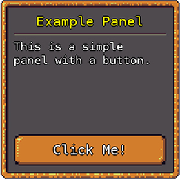

# Using GeonBit

Now its time to finally learn how to use *GeonBit* to make your next awesome game!

## Game Objects & Components

As mentioned before, *GameObjects* are the basic entity in the Entity-Component model. Everything in your game is a *GameObject*.

Lets start by creating a new *GameObject*:

```cs
using GeonBit.ECS;
...

GameObject player = new GameObject("player", SceneNodeType.Simple);
```

The code above will create an empty *GameObject* called player, with a simple node type. We'll go over node types and their meaning later, but right now all you need to know is that a simple node type don't do any culling or optimizations, and is the best fit for objects you expect to always be visible.

Now lets add the player to the active scene and set its position:

```cs
player.Parent = ActiveScene.Root;
player.SceneNode.Position = new Vector3(0, 1, 0);
```

Run the game and... nothing happens. This is because setting up empty *GameObjects* won't really draw anything, unless we add some render components to them. So lets add a shape renderer to draw a sphere:

```cs
using GeonBit.ECS.Components.Graphics;
...

player.AddComponent(new ShapeRenderer(ShapeMeshes.SphereLowPoly));
```

Our full ```GeonBitGame``` code now look like this:

```cs
using Microsoft.Xna.Framework;
using GeonBit.ECS;
using GeonBit.ECS.Components.Graphics;

namespace GeonBitExamples
{
    /// <summary>
    /// Main for the game itself.
    /// </summary>
    public class MyGame : GeonBitGame
    {
        /// <summary>
        /// Create the game class.
        /// </summary>
        public MyGame()
        { 
			// optional settings:
			EnableVsync = true;
			DebugMode = true;
			UiTheme = "hd";
		}

        /// <summary>
        /// Override this to implement Update() function for your game to be called every frame.
        /// </summary>
        /// <param name="gameTime">Provides a snapshot of timing values.</param>
        override public void Update(GameTime gameTime)
        {
            // exit on escape
            if (Managers.GameInput.IsKeyDown(GeonBit.Input.GameKeys.Escape))
            {
                Exit();
            }
        }

        /// <summary>
        /// Override this to initialize game scenes and load data.
        /// </summary>
        override public void Initialize()
        {
		    // create player and add to scene
            GameObject player = new GameObject("player", SceneNodeType.Simple);
            player.Parent = ActiveScene.Root;
			
			// set position and add sphere component
            player.SceneNode.Position = new Vector3(0, 1, 0);
            player.AddComponent(new ShapeRenderer(ShapeMeshes.SphereLowPoly));
        }

        /// <summary>
        /// Override this to implement custom drawing logic.
        /// </summary>
        /// <param name="gameTime">Provides a snapshot of timing values.</param>
        override public void Draw(GameTime gameTime)
        {
        }
    }
}
```

And it should look like this:


Take your time and explore the different *Components* found under namespaces ```GeonBit.ECS.Components.*```. These are the basic tools that you use to build your game.


## Loading Resources

When using *GeonBit* you shouldn't access *MonoGame*'s ```ContentManager``` directly, but use *GeonBit*'s ```ResourcesManager``` instead.

To access the ```ResourcesManager``` from inside ```GeonBitGame``` or a custom ```Component```, simply use the ```Resources``` getter. Its API is fairly simple and staright forward.

For example, to get a model:

```cs
Model model = Resources.GetModel("path/to/model/file");
```

## Creating A Custom Component

The built-in *Components* cover basic generic things like rendering, sound, physics, etc. 
But they do not cover game-specific elements like monsters AI, player controllers, and aspects of your game logic itself. Those things are yours to make.

Lets start by creating a simple controller that will move our "player", the sphere from previous example:

```cs
/// <summary>
/// A component to move the sphere using the game controls.
/// </summary>
public class PlayerController : ECS.Components.BaseComponent
{
	/// <summary>
	/// Clone this component.
	/// </summary>
	/// <returns>Cloned PlayerController instance.</returns>
	public override ECS.Components.BaseComponent Clone()
	{
		return new PlayerController();
	}

	/// <summary>
	/// Do on-frame based update.
	/// </summary>
	protected override void OnUpdate()
	{
		// moving speed
		float movingSpeed = 10f;

		// Move up
		if (GameInput.IsKeyDown(Input.GameKeys.Forward))
		{
			_GameObject.SceneNode.PositionY += TimeManager.TimeFactor * movingSpeed;
		}
		// Move down
		if (GameInput.IsKeyDown(Input.GameKeys.Backward))
		{
			_GameObject.SceneNode.PositionY -= TimeManager.TimeFactor * movingSpeed;
		}
		// Move left
		if (GameInput.IsKeyDown(Input.GameKeys.Left))
		{
			_GameObject.SceneNode.PositionX -= TimeManager.TimeFactor * movingSpeed;
		}
		// Move right
		if (GameInput.IsKeyDown(Input.GameKeys.Right))
		{
			_GameObject.SceneNode.PositionX += TimeManager.TimeFactor * movingSpeed;
		}
	}
}
```

In the code above we defined a new *Component* type, called ```PlayerController```.

The first function, ```Clone()```, is something basic all *Components* must implement. It should return a copy of the *Component* itself.

The second function, ```OnUpdate()```, is the interesting part. This function as an event that will be called every frame, provided that the *GameObject* the component is attached to is currently alive and enabled (more on that later and the subject of events).

We use the ```GameInput``` manager to check if user pressed interesting keys. The ```GameInput``` manager is a high-level input helper that help us bind keyboard and mouse keys to abstract ```GameKeys```.

The default key settings are suitable for FPS games, and that's why we use ```GameKeys.Forward``` and ```GameKeys.Backward``` (which are bound to arrow up and down keys) instead of ```GameKeys.Up``` and ```GameKeys.Down```.

Next we see that when the right keys are pressed we change the position of ```_GameObject.SceneNode```. Inside a *Component* class, the ```_GameObject``` will always point on the parent *GameObject* the *Component* is attached too, so by moving this object the controller will move whatever *GameObject* it is currently attached to.

And one last fill to note is ```TimeManager.TimeFactor```. ```TimeManager``` is another manager class that help us manage game time and framerate independent movement and animations. By multiplying our movement with ```TimeManager.TimeFactor```, we guarantee that the sphere will move at the same speed regardless of FPS rate.

In real games we usually won't really move the player like that, but use a physical body instead (explained later), but right now for the simplicity of this tutorial we will move the sphere without any physics.

So now after making our controller all we are left to do is attach it to our *player*:

```cs
player.AddComponent(new PlayerController());
```

And voilà, pressing the arrow keys should now move the sphere around.

When implementing a *Component* there are many `events` we can use similar to ```OnUpdate()```. For example, we have a function to override that will be called when the object spawns or when it is destroyed, etc. We will cover the different events that a *Component* can respond to later in this doc.


## Component Events

As you seen before, every *Component* has the ```OnUpdate()``` event, which is called every frame. Component operate via a set of predefined events that trigger at different times, like when the component is added to a new parent, when its destroyed, etc.

To implement sophisticated components, its important to know the different events you can use.
The following is a list of all the built-in events and how they normally behave.

### OnSpawn

Triggers either when the scene loads, of when the *GameObject* containing the component is added to an already-spawned scene.

### OnDestroyed

Called when the *Component* is destroyed.

Note: simply removing from scene will not trigger this. It will only be triggered when the component is cleared from memory (eg collected by the GC) or if ```Destroy()``` is called.

### OnDisabled

Called when the *Component* or the *GameObject* containing it becomes disabled.

### OnEnabled

Called when the *Component* or the *GameObject* containing it becomes enabled, after it was disabled.

### OnUpdate

Triggers every frame on all objects, as part of the ```Update``` step. This is the place to put code that needs to execute every frame.

### OnBeforeDraw

Triggers on a *Component* before its parent *GameObject* is being rendered, but only if its currently visible (based on previous frame check). In other words, if a *GameObject* is scene node is currently culled out, it will not trigger this event.

### OnRemoveFromScene

Triggers when the *GameObject* containing the *Component* is removed from a scene. This event will trigger even if its not the currently active scene.

### OnAddToScene

Triggers when the *GameObject* containing the *Component* is added to a scene. This event will trigger even if its not the currently active scene.

### OnParentChange

Triggers whenever the *Component* is added or removed from a *GameObject*.

### OnCollisionStart

Triggers when one *GameObject* with a physical-body component collides with another *GameObject* with physical-body component.

Note: this event will trigger once per impact (when it starts), and will trigger on both colliding *GameObjects* components.

### CollisionEnd

Triggers when one *GameObject* with a physical-body component *stop colliding* with another *GameObject* with a physical-body component.

Note: this event will trigger once per impact (when it ends), and will trigger on both colliding *GameObjects* components.

### OnCollisionProcess

Triggers every physical frame while one *GameObject* with a physical-body component is touching another *GameObject* with a physical-body component.

Note: this event will trigger on both colliding *GameObjects* components.

### OnHeartbeat

An event that triggers every defined interval (set per *GameObject*), during the ```Update``` step.
Note: may trigger multiple times per frame, if interval is smaller than time between frames.

### OnFixedUpdate

Triggers every constant time interval on all objects, as part of the ```Update``` step. Unlike the similar ```OnUpdate``` event, the fixed update is FPS independent even if v-sync is disabled.

### OnReceiveMessage

Event that triggers programmatically, via the ```SendMessage()``` function. This provide a simple way for inter-components communication, even without knowing the other components currently attached to the *GameObject*.


## Built-In Components

The following is an abridged list of the most important built-in components *GeonBit* have to offer, and when to use them. For the full list of *Components* and their API, please revise the docs or explore the ```GeonBit.ECS.Components``` namespace via code.


### Graphics

The following is a list with few of the built-in graphic-related components:

#### Camera

Create a camera object, eg point-of-view of the player. There can be only one active camera at-a-time, and scenes without camera will not render anything.

```cs
gameObject.AddComponent(new Camera());
```

#### ModelRenderer

Render a simple 3d model.

Usage example:

```cs
gameObject.AddComponent(new ModelRenderer("asset_path"));
```

#### ShapeRenderer

Render a 3d shape from a set of predefined models.

Usage example:

```cs
gameObject.AddComponent(new ShapeRenderer(ShapeMeshes.Cube));
```

#### SkinnedModelRenderer

Render a 3d model with skinned animation (be sure to set the content importer to GeonBit skinned animation).

Usage example:

```cs
gameObject.AddComponent(new SkinnedModelRenderer("asset_path"));
```

#### BillboardRenderer

Render a texture that always faces camera.

Usage example:

```cs
gameObject.AddComponent(new BillboardRenderer("asset_path"));
```

#### Sprite

Just like BillboardRenderer, but support spritesheet based animation (eg changing UV coords at runtime to play different animations).

This component is a fit for a 2.5D games (like Doom, Duke3d, etc.) where enemies are animated sprites in 3D space.

Usage example:

```cs
// create spritesheet data for a spritesheet containing 4 rows and 8 columns.
var spritesheet = new SpriteSheet(new Point(8, 4));

// create a sprite that uses the spritesheet data above, with "texture_path" as texture.
gameObject.AddComponent(new Sprite(spritesheet, "texture_path"));
```


#### SkyBox

Render a 3D skybox with skybox texture.

Usage example:

```cs
gameObject.AddComponent(new SkyBox("texture_path"));

// OR

Managers.GraphicsManager.CreateSkybox("texture_path", scene.Root);
```


### Physics

The following is a list with few of the built-in physics-related components:

#### PhysicalBody

A physical body that attaches to a game object and controls its transformations (position & rotation).

Usage example:

```cs
PhysicalBody playerPhysics = new PhysicalBody(new BoxInfo(bodySize), inertia: 0f);
playerPhysics.SetDamping(0.95f, 0.95f);
playerPhysics.Gravity = Vector3.Down;
playerPhysics.CollisionGroup = (short)CollisionGroups.Player;
playerGameObject.AddComponent(playerPhysics); 
```


### Sound

The following is a list with few of the built-in sounds-related components:

#### BackgroundMusic

Plays background music from a media file (note: can only have 1 active background music playing at a time).

Usage example:

```cs
gameObject.AddComponent(new BackgroundMusic("song_file_path"));
```


#### SoundEffect

Plays a sound effect (can be a 3d sound).

Usage example:

```cs
gameObject.AddComponent(new SoundEffect("sound_file_path"));
```


### Misc

The following is a list with some of the built-in misc components you should know:

#### CameraEditorController

Attach keyboard & mouse controller to a GameObject that implements editor-like controls. Be sure to attach this to the *GameObject* with the scene active camera.

This object is great for debug and development process.

Usage example:

```cs
gameObject.AddComponent(new CameraEditorController());
```

#### TimeToLive

A very cruel timer that destroy its owner after X seconds. Use this for objects you want to appear only for a known period of time.

Usage example:

```cs
gameObject.AddComponent(new TimeToLive(5.0f));
```

#### TileMap

Helper component to create and manage a 3D tiles map.

Usage example:

```cs
// create tilemap and add to a game object
var tilemap = new TileMap(tileSize);
gameObject.AddComponent(tilemap);

// get a tile from the tilemap (this will also create it if don't exist yet)
GameObject tile = tilemap.GetTile(index);
```

#### ParticleSystem

A component that spawns multiple particles based on a set of rules. Use this to create effects like fire, smoke, etc.

Usage example:

```cs
using GeonBit.ECS.Components.Particles;
using GeonBit.ECS.Components.Particles.Animators;
...

// define the particle prototype and add some animators to it
GameObject particle = new GameObject("particle", SceneNodeType.ParticlesNode);
ShapeRenderer shape = particle.AddComponent(new ShapeRenderer(ShapeMeshes.Sphere), "model") as ShapeRenderer;
shape.RenderingQueue = Core.Graphics.RenderingQueue.Effects;
particle.AddComponent(new TimeToLive(3f));
particle.AddComponent(new FadeAnimator(BaseAnimatorProperties.Defaults, 1f, 0f, 2.5f, 0.5f));
particle.AddComponent(new MotionAnimator(BaseAnimatorProperties.Defaults, Vector3.Up * 25f, acceleration: Vector3.Down * 15f, velocityDirectionJitter: Vector3.One * 5));
particle.AddComponent(new ScaleAnimator(BaseAnimatorProperties.Defaults, 0.5f, 1.5f, 4f, 0.5f, 0.5f, 0.5f));
particle.AddComponent(new ColorAnimator(BaseAnimatorProperties.Defaults, Color.Red, Color.Orange, 3f));

// create particles system
GameObject systemObject = new GameObject("system1", SceneNodeType.Simple);
ParticleSystem system = systemObject.AddComponent(new ParticleSystem()) as ParticleSystem;
system.AddParticleType(new ParticleType(particle, frequency: 0.85f));
systemObject.Parent = scene.Root;
```

Note that in the example above we use animator components from ```GeonBit.ECS.Components.Particles.Animators``` namespace. 
While we're not going to cover them in this doc, its recommended to take a look at the different animators that come with *GeonBit*. You might find some of them useful, even outside of a particles system.


## Scenes

As mentioned before, a *GameScene* wraps a tree of *GameObjects*, and usually represent a stage, level, or a screen in your game. 

By default, *GeonBit* creates and load an empty scene with a single camera, so you can easily place and see entities without any preperation code. However, its always recommended to create your own scene (or load one from a file) rather than using the default scene.

### Creating a Scene

Creating a scene is easy:

```cs
using GeonBit.ECS;
...

// create a new empty scene
GameScene scene = new GameScene();
```

One created, you can start adding objects to its root:

```cs
// add a game object to the new scene
someObject.Parent = scene.Root;
```

The *root* object of the scene is an empty *GameObject* to you can place your objects under. 
Everything under this *GameObject* will be considered a part of this scene.

### Loading Scene

To load the scene (eg make it the currently active scene), use the ```Load()``` function:

```cs
scene.Load();
```

Note that this action will unload the currently active scene and replace it with the new scene, which means all the non-persistent data of the previous scene will be lost.

Once loaded, the scene will trigger ```OnSpawn``` events to its children.


## Managers

Managers in *GeonBit* are singleton classes that provide utilities and access API for a certain aspect of the game. 

While inside a ```GeonBitGame``` or a ```Component``` scope, there's a shortcut for all the built-in Managers via the ```Managers``` instance. 
For example, if you want to access the *Sound* Manager from inside a component:

```cs
Managers.SoundManager.PlayMusic("my_jam");
```

If you are outside of ```GeonBitGame``` or a component scope, you can still access managers via their instance getter:

```cs
GeonBit.Managers.SoundManager.Instance.PlayMusic("my_jam");
```

The following is a list of all the main Managers you should know in *GeonBit*:


### Application

Provide application-level functions as well as the currently active scene.
Via this manager you can do things like loading scenes, exit the game, etc.

Usage example:

```cs
// exit the game
Managers.Application.Exit();
```


### GameInput

Provide API to get game input and bind keyboard and mouse keys to logical 'game keys'.
For example, you can use this manager to set that bot ```Space``` key or ```Left mouse button``` will mean 'fire', and then test if player hit ```fire``` key:

```cs
if (Managers.GameInput.IsKeyDown(GeonBit.Input.GameKeys.Fire))
{
    // fire your weapon!
}
```

In addition, it provides an API to save and load control settings, and switch between a set of pre-defined commonly used layouts.


### GraphicsManager

Provide graphic-related utilities.


Usage example:

```cs
// create a GameObject with background component attached to it, loaded from 'background_image'.
// note: you can easily do this manually by creating a new GameObject and adding the component yourself, this helper function just saves you some code.
GameObject background = Managers.GraphicsManager.CreateBackground("background_image", scene.Root);
```


### SoundManager

Provide sound-related utilities.


Usage example:

```cs
// play back_music, on repeat and 0.75 volume.
// note: you can also create a GameObject and attach background music component to it if you want the back music to be attached to the scene.
Managers.SoundManager.PlayMusic("back_music", true, 0.75f);
```


### TimeManager

Manage in-game time. This manager helps you keep track on your game time, but more importantly, provide a time factor to multiply things to keep them FPS independant.

For example, if you want to move a model by 50 units in game seconds*, you can multiply its movement with the time factor.

Usage example:

```cs
// move object 'go' in an fps-independant way, based on game time
go.SceneNode.PositionX += speed * Managers.TimeManager.TimeFactor;
```

Note that by default ```game time == real time```. In other words, one second in real life means one second in game time. However, you can change that by playing with the game time factor:

```cs
// this will make 1 second in real world equals to 2 seconds in game time.
Managers.TimeManager.TimeSpeed = 2f;
```


### GameFiles

A think wrapper for writing and reading serializeable objects from files located in a special `game` folder.
If you want to dynamically read and write game files, use this manager.


Usage example:

```cs
// write someObject to a game-file
Managers.GameFiles.WriteToFile(FileFormats.Binary, "filename", someObject);
```


### ConfigStorage

Provide simple API to store config-related data on disk (player preferences etc).
Note: usese ```GameFiles``` manager internally.

Usage example:

```cs
// put config on disk (some_value can be any serializeable object or string)
Managers.ConfigStorage.Set("config_key", some_value);

// get config from disk
var config = Managers.ConfigStorage.Get<SomeType>("config_key");
```


### Diagnostic

Provide diagnostic and debug data.


Usage example:

```cs
// get full report string
string report = Managers.Diagnostic.GetReportString();
```


### Prototypes

Its reasonable to want to instantiate a specific *GameObject* multiple times. 

For example, you might want to create a *GameObject* that represent an enemy type, and clone it several times for different locations of your level (assuming your game have more than one enemy in it..).

One way to do it is simply creating the enemy *GameObject* once and use the ```Clone()``` method to duplicate it multiple times. Another way would be writing a function that build a new enemy *GameObject* from scratch (not recommended).

But the best way is to use Prototypes.

Prototypes manager is a relatively simple object that let you store *GameObject* instances and later reuse them from anywhere in your game.

For example, after creating your enemy *GameObject* and adding all its components, you can register it to the Prototypes bank:

```cs
Managers.Prototypes.Register(enemyGameObject, "enemy");
```

And whenever you want to spawn a new enemy instance, you can fetch it from Prototypes:

```cs
GameObject newEnemy = Managers.Prototypes.Spawn("enemy");
```

Using Prototypes to instantiate *GameObject* types is recommended for both readability and to enjoy internal optimizations that might be added to *GeonBit* at later versions.


## UI

As mentioned before, *GeonBit* comes with its own UI system, called *GeonBit.UI*. You can find *GeonBit.UI* full docs [here](https://github.com/RonenNess/GeonBit.UI). 

In this chapter we'll only go through on how *GeonBit.UI* is integrated inside *GeonBit*.

### Scene.UserInterface

Every *GeonBit* scene comes with its own UserInterface manager. 
Whenever you load a scene, its UI will also load and becomes the active UI, also accessible as ```GeonBit.UI.UserInterface.Active```.

Its important to remember that when changing UI cursor, scale, etc. you are actually affecting the UI of the currently active scene, and switching scenes might override those changes.

You don't need to worry about calling ```UserInterface.Draw()``` or ```UserInterface.Update()```, *GeonBit* does that automatically.

### Quick Example

Here's a quick example on how to add a basic panel with some entities to a scene's UI:

```cs
// create a panel and position it in center of screen
Panel panel = new Panel(new Vector2(400, 400), PanelSkin.Default, Anchor.Center);

// add to the scene's UI
scene.UserInterface.AddEntity(panel);

// add title and text
panel.AddChild(new Header("Example Panel"));
panel.AddChild(new HorizontalLine());
panel.AddChild(new Paragraph("This is a simple panel with a button."));

// add a button at the bottom
panel.AddChild(new Button("Click Me!", ButtonSkin.Default, Anchor.BottomCenter));
```

Whenever the scene is loaded, you should see something like this:



### Copying and Creating new UIs

If you want multiple scenes to share the same UI, you can simple copy the UI from one scene to another:

```cs
// copy the UI from scene2 into scene 1:
scene1.UserInterface = scene2.UserInterface;
```

Or to create a new empty UI:

```cs
// create a new, empty UI for scene1:
scene1.UserInterface = new GeonBit.UI.UserInterface();
```

