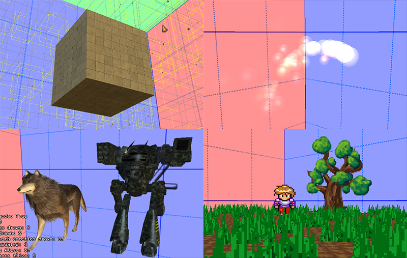

# Warning

This project is a bit old and no longer maintained. Also some would argue its not a real ECS due to the structure of the components and lack of actual systems.
It's still a pretty cool framework, just maybe not what you're looking for.

# GeonBit

**A 3D Entity-Component-System engine, powered by MonoGame for C# games.**

# License

MIT

# Documentation

GeonBit docs are available [by chapters](docs/index.md) or [as a single file](docs/README.md).

In addition, complete API docs can be found online [here](https://ronenness.github.io/GeonBit-docs/).

# Installation

Installing and using *GeonBit* takes only [3 simple steps](docs/chapters/setup.md)!

# Demos

Some *GeonBit* demo projects are available [here](https://github.com/RonenNess/GeonBit.Demos). 
Feel free to download and use them!

# Changelog

Versions changelog can be found [here](docs/changes.md).

