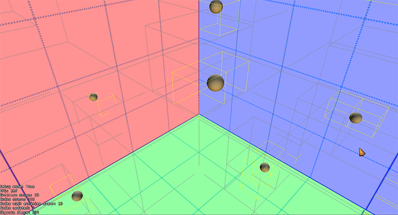

# Advanced Topics

This chapter dives deeper into *GeonBit*, and contains useful information about some of the inner works and optimizations. 

While this might sound like an optional nice-to-have reading, its actually quite critical for most projects. 


## Scene Nodes & Culling

A *SceneNode* is the part of the *GameObject* that represent its 3D transformations and position. Every *GameObject* holds a single *SceneNode*, and when you scale or move a *GameObject*, you actually transform its *SceneNode*.

While there's only one type of generic *GameObject* you can use, there are different types of *SceneNodes* that are optimized for different purposes. 
Knowing the different *SceneNode* types can be crucial to performance.

The following is a list of the main *SceneNodes* you should know, and when to use them.

### Simple

*Simple* is the most basic (and default) scene node type, that don't do any culling or optimizations. Use this type for objects that are always visible.
For example, if you build an FPS game and make a *GameObject* to render the weapon your character is holding, its best to use a *Simple* node for the weapon *GameObject* as it will always be visible and should never be optimized or culled.

To create a *GameObject* with *Simple* node type:

```cs
// create a new Game Object with simple scene node.
GameObject newObj = new GameObject("go_name", SceneNodeType.Simple);
```

### BoundingBoxCulling

*BoundingBoxCulling* is a scene node that calculates its bounding box (including its child nodes), and cull out when outside the camera [view frustum](https://en.wikipedia.org/wiki/Viewing_frustum).

You should use this type of node for large models that fit nicely inside a box, and may be off screen at least part of the time. 
Note however that calculating the bounding box adds some overhead of its own, so its not a good option for large quantity of constantly moving objects.

Its also important to mention that drawing happens recursively, eg a scene node will first test and draw itself, then its children, they will draw their children, and so forth.
You can take advantage of that to divide your scene in a more optimal way and gain better performance from culling.
 
For example, if you have a *GameObject* that represents a room and there are lots of furnichairs inside of it, making the furnichairs *GameObjects* children of the room *GameObjects* (in opposite to just putting them all under scene root) will actually make culling a lot faster, especially when the entire room is hidden and can skip the culling tests of its children completely.
In general, its always recommended to build your scene in a logical way, especially for static objects that cannot move.

To create a *GameObject* with *BoundingBoxCulling* node type:

```cs
// create a new Game Object with box-culling scene node.
GameObject newObj = new GameObject("go_name", SceneNodeType.BoundingBoxCulling);
```

### BoundingSphereCulling

*BoundingSphereCulling* is just like ```BoundingBoxCulling```, but uses a bounding sphere instead of a box.

The main difference is that a bounding sphere is easier to create and test against the camera frustum, and it may be more fittin for different type of models.

To create a *GameObject* with *BoundingSphereCulling* node type:

```cs
// create a new Game Object with sphere-culling scene node.
GameObject newObj = new GameObject("go_name", SceneNodeType.BoundingSphereCulling);
```

### ParticlesNode

*ParticlesNode* is a special scene node optimized for CPU-based particles. We will cover particles later, for now just know it exists.

You should use this node type for when you have lots of small, constantly moving objects that shift in and out of screen.

To create a *GameObject* with *ParticlesNode* node type:

```cs
// create a new Game Object with particles scene node.
GameObject newObj = new GameObject("go_name", SceneNodeType.ParticlesNode);
```

### OctreeCulling

*OctreeCulling* node is perhaps the most important node type to know, that can make the greatest impact on your game performance.

An [Octree](https://en.wikipedia.org/wiki/Octree) is basically a tree where every node has exactly 8 children. In computer graphics, every Octree node is a bounding-box divided into 8 smaller boxes, with half its parent width, height and length.
Octree culling use this structure to 'divide and conquer' the scene. First we break the entire level into 8 and test each section bounding box with camera frustum. Only the parts that are visible will then check its 8 children, and so forth, until reaching a minimal bounding box size and iterate its entities.

Needless to say, the Octree node does not create all nodes upfront as it is wasteful to memory; It dynamically creates and remove nodes as needed.

An Octree node is best for large, static levels containing lots of models that don't transform. Its less optimal for massive amount of rapidly moving objects (although still better than other methods) and for very large objects that can't fit in the smaller bounding boxes.
Its also important to note that the octree node has a limited size and objects that reside outside of it will not be culled properly.

Octrees are very complicated subject and its recommended to read more about it on different online resources.

To create a *GameObject* with *OctreeCulling* node type:

```cs
// create a new Game Object with octree scene node with default settings.
GameObject newObj = new GameObject("go_name", SceneNodeType.OctreeCulling);

// OR: create a new Game Object with octree scene node and custom properties
GameObject newObj = GameObject.CreateOctree(origin, size, maxDivisions);
```

When creating octree with default settings, it will use ```GameObject.OctreeSceneBoundaries``` as bounding box, and ```GameObject.OctreeMaxDivisions``` as max divisions.


[An octree example with bounding-boxes rendered. Yellow boxes are segments that contain entities.]

## Rendering Queues

If you tried drawing multiple 3D objects with opacity before reading this chapter, you probably noticed a weird phenomenal; they sometimes hide each other as if they were solid, eg the background object is not seen at all instead of merging with the front transparent object.

The reason for that is because if you write half-transparent pixels to the depth buffer, they later hide background pixels completely instead of merging with them.

Luckily for us, this problem is easily solved via [transparency sorting](https://www.khronos.org/opengl/wiki/Transparency_Sorting) and disabling the depth buffer. However, applying these techniques on solid, plain objects will be a terrible waste of optimizations.

So in order to satisfy the needs of different graphical objects, *GeonBit* uses a set of different ```rendering queues```.

Every rendering queue has its time in the rendering process, and different rendering queues treat things like depth buffer, sorting, and face culling differently.

You can set on which queue to draw every graphical component via the ```RenderingQueue``` property:

```cs
explosion.RenderingQueue = RenderingQueue.EffectsUnordered;
```

There are lots of built-in rendering queues in *GeonBit* designed for different purposes, to know them all check out the docs on the ```RenderingQueue``` enum.


## Materials

A material is an object that describes how to render a given surface. 
Materials are made of an Effect (eg shaders) and some extra data (diffuse color, specular, sampling mode, etc..).

*GeonBit* provide 6 basic Materials you can use:

#### BasicMaterial

Render smooth surfaces with constant static lights. This material uses MonoGame ```BasicEffect```.

Note: this material is not very optimized and is designed for testing and development phase. You should write your own material and effect to replace it.

#### AlphaTestMaterial

A material that performance alpha test and omit invisible pixels. This material uses MonoGame ```AlphaTestEffect```.

Note: this material is not very optimized and is designed for testing and development phase. You should write your own material and effect to replace it.

#### SkinnedMaterial

A material that support GPU skinned animation. This material uses MonoGame ```SkinnedEffect```.

Note: this material is not very optimized and is designed for testing and development phase. You should write your own material and effect to replace it.

#### SkyboxMaterial

A special material used to render skybox (and potentially skydome, if you implement one). This material uses MonoGame ```BasicEffect```, without lighting and with constrant world matrix.

#### SpriteMaterial

A material used to render sprites and billboards. This material uses MonoGame ```AlphaTestEffect```.

#### LitMaterial

A basic material that support dynamic lighting via the Lights Manager (explained later).

### Materials Mapping

Whenever *GeonBit* loads a 3d model, it will generate materials to fit its effect (as defined in the content manager).
For example, if you have a model loaded with ```BasicEffect```, *GeonBit* will create a ```BasicMaterial``` to use with this model.

You can change which materials are assigned to which effects using the ```DefaultMaterialsFactory``` static class:

```cs
using GeonBit.Core.Graphics.Materials;
..

// change how we create material for basic effects
DefaultMaterialsFactory.SetDefaultMaterialGenerator(MaterialTypes.Basic, (Effect mgEffect) => 
	{
		return new MyCustomMaterial((BasicEffect)mgEffect, true);
	}
);
```

As you can see from the code above, the ```DefaultMaterialsFactory``` is a static class that hold a function to generate materials for different effect types. 
When loading a new model, those generation functions will be called.

Since the materials that come with *GeonBit* are very basic and limited, normally you would want to create your own material types and assign them to the default effect types.


### Create Custom Materials

To create your own material you need to inherit from the MaterialAPI class and implement 3 important functions:

1. Effect getter, which should return the effect your material uses.
2. MaterialSpecificApply(), which should setup your effect before rendering.
3. Clone(), to clone your effect.

For example:

```cs
/// <summary>
/// A custom material type.
/// </summary>
public class MyCustomMaterial : MaterialAPI
{
	// the effect instance of this material.
	BasicEffect _effect;

	/// <summary>
	/// Get the effect instance.
	/// </summary>
	public override Effect Effect { get { return _effect; } }

	/// <summary>
	/// Create the custom material from empty effect.
	/// </summary>
	public MyCustomMaterial() : this(new BasicEffect(GraphicsManager.GraphicsDevice), true)
	{
	}

	/// <summary>
	/// Create the custom material.
	/// </summary>
	/// <param name="effect">Effect to use.</param>
	public MyCustomMaterial(BasicEffect effect)
	{
		_effect = effect;
	}

	/// <summary>
	/// Apply this material.
	/// </summary>
	override protected void MaterialSpecificApply(bool wasLastMaterial)
	{
		// set world matrix
		_effect.World = World;

		// set other effect params here..
	}

	/// <summary>
	/// Clone this material.
	/// </summary>
	/// <returns>Copy of this material.</returns>
	public override MaterialAPI Clone()
	{
		MaterialAPI ret = new MyCustomMaterial(_effect);
		CloneBasics(ref ret);
		return ret;
	}
}
```

If effect uses lights you can also implement the ```ApplyLights()``` function, and if you want to use the built-in managed lights you should also set ```UseDefaultLightsManager``` getter to return true.

For more info, check out the implemented materials in ```Core/Graphics/Materials```.


## Combined Meshes

For some 3d games you might want to build the levels from lots of static, modular models: floor tiles, wall parts, trees, doodads, etc.

Without any optimizations, a large level made like this can cause a lot of draw calls per frame. And that can impact performance.

To tackle that issue, *GeonBit* comes with a built-in mesh combiner, that takes a list of models to draw with transformations and combine them into a single, larger mesh, thus reducing the draw calls.

To create a ```CombinedMeshesRenderer``` component:

```cs
// create a combined mesh renderer and attach to a gameobject called 'level'
CombinedMeshesRenderer combined = new CombinedMeshesRenderer();
combined.RenderingQueue = GeonBit.Core.Graphics.RenderingQueue.Terrain;
level.AddComponent(combined);
```

And then you can start adding meshes and models to it:

```cs
// create transformations for the model
GeonBit.Core.Transformations meshTransform = new GeonBit.Core.Transformations();
meshTransform.Scale = Vector3.One * 10f;
meshTransform.Position = new Vector3(100, 0, 50);

// get model to add
var model = GeonBit.Core.ResourcesManager.Instance.GetModel("tree");

// add model to combined meshes renderer
combined.AddModel(model, meshTransform.BuildMatrix());

// or, you can add the model with specific material:
combined.AddModel(model, meshTransform.BuildMatrix(), material);
```

And you can even add primitives directly, without using meshes:

```cs
combined.AddVertices(vertices, indexes, transformations, material);
```

When done adding all the parts, you must call ```Build()```, which will actually create the internal combined buffers:

```cs
combined.Build();
```

Note that once ```Build()``` is called you can no longer add new parts to the combined mesh, unless you call ```Clear()``` (which will remove everything from it).

### Warnings

Some things to be cautious about with Combined Meshes Optimizer:

- If you make your combiners too big (for example the entire level in a single combiner) you may lose culling-base optimizations, and end up with worse performance. Its best to chunk down large levels into multiple combiners.
- Combined meshes are static; you can no longer transform them and they don't support animation.
- Building combined meshes is (relatively) a heavy task. Its fast enough for level initialization, but avoid rebuilding too often during runtime.


## Physics

The physics simulation in *GeonBit* uses the open-source Bullet3D library. Physics in *GeonBit* includes:

- Rigid bodies.
- Kinematic bodies.
- Static bodies.
- Collision detection and ray casting.

This chapter will explain how to use GeonBit physics.


### Rigid Body

As shortly mentioned before, Rigid Body is a physical body that respond to forces and can be attached to *GameObjects*.

Once a Rigid Body is attached to a *GameObject* it will control its position and rotation based on the physics simulation.

Rigid bodies are commonly used for dynamic objects (player, enemies, projectiles, moveable objects, etc..).

To create a rigid body:

```cs
// create a rigid body component with a box shape (sized 10x10x10). note: inertia 0 will prevent rotation
RigidBody body = new RigidBody(new BoxInfo(new Vector3(10,10,10), mass: 10f, inertia: 0f);
go.AddComponent(body);
```

### Kinematic Body

Kinematic Body is a physical body that does not respond to external forces. A kinematic body will simply take the transformations of its parent *GameObject*.

It is useful for elevators, moving platforms, etc.

To create a kinematic body:

```cs
KinematicBody elevatorPhysics = new KinematicBody(new BoxInfo(bodySize));
elevator.AddComponent(elevatorPhysics); 
```

### Static Body

Static Body is similar to a Kinematic Body, but will not produce collision events by default (can be changed) and is optimized for immobile objects.

It is useful for things like walls, trees, rocks, etc.

To create a static body:

```cs
StaticBody wallPhysics = new StaticBody(new BoxInfo(bodySize));
wall.AddComponent(wallPhysics); 
```

### Collision Shapes

In the examples above we created physical bodies using a simple box shape.

There are several built-in "Shape Infos" classes that help you quickly build basic shapes, or you can use any of the collision shapes defined under the ```GeonBit.Core.Physics.CollisionShapes``` namespace.

Among all the basic predefined shapes (box, sphere, cone, capsule, etc..) there are also few special shapes we should mention here:

- **CollisionCompoundShape**: A shape that combine together several other shapes. This is useful either for complex bodies or to optimize lots of static objects by banding them together.
- **CollisionConvexHull**: If the built-in shapes are not enough, you can create a convex hull shape from an array of points.
- **CollisionEndlessPlane**: A quick way to create an endless plane that can prevent things from falling or make an invisible wall block.
- **CollisionHeightMap**: A heightmap made of matrix of points. Useful to represent terrains.

### Debugging Physics

You can enable a special debug renderer that will draw all physical shapes and forces:

```cs
Managers.Diagnostic.DebugRenderPhysics = true;
```

Please note however that the debug rendering are not very optimized and may be heavy on performance.

### Collision Groups

Collision groups allow you to control which objects can collide with which other objects.
For example, in your game you might decide that enemy bullets will not hit other enemies and just go through them. In other words, you might want to decide that enemy bullets only collide with player and static objects (walls etc).

Controlling collision groups is not just for gameplay features, its also crucial for performance. For example, if you have a huge level with lots of static objects (trees, rocks, etc.), you can actually boost couple hundred FPS just by making those static objects collision groups mismatch.

To control collisions, you need to set two flags: collision Groups and Masks.

- Collision Group represent the physical object "type".
- Collision Mask tells the body with which other types it may collide.

When two bodies collide, the physics simulator will do an ```AND``` operator between the collision group of one body and the mask of the other, and if the result is not 0, they will collide.
This means that a body can be in multiple collision groups and all it takes is one match to make a collision.

So if we go back to the example above of optimizing trees not to collide with each other, how would we do it?

We could define two object types: ```static``` and ```dynamic```. Dynamic objects (monsters, player, projectile, etc..) will collide with everything. Static objects (floor, trees, rocks, etc) will only collide with dynamic objects, but not with each other.

Lets see an example of how to set the collision group of a physical body:

```cs
bulletBody.CollisionGroup = CollisionGroups.EnemyProjectiles;
```

The enum-like object ```CollisionGroups``` provide a set of predefined collision groups commonly used in games. 
You don't have to use the built-in groups, but they should be quite convenient.

Now lets set the collision mask of the bullet from before:

```cs
// CollisionMasks contains a predefined set of useful masks you can use.
short bulletMask = CollisionGroups.OR(CollisionMasks.NonCharacterTargets, CollisionGroups.Player);
bulletBody.CollisionMask = bulletMask;
```

So what did we just do? First, we defined a new collision mask for the bullet, composed of ```CollisionMasks.NonCharacterTargets``` and ```CollisionGroups.Player``` groups.

- *CollisionMasks.NonCharacterTargets* is a pre-defined set of collision groups that contain all the possible targets, except for characters.
- *CollisionGroups.Player* is the collision group we'll later assign for the player's body.

After setting the bullet with this collision mask, it will only collide with non-character targets (terrain, static objects, etc.) and with the player group.

Now we want to set the player's collision group:

```cs
playerBody.CollisionGroup = CollisionGroups.Player;
```

Now bullets will be able to hit the player, but not the enemies or each other.


### Collision Callbacks

If you want to respond to collsion between objects, you need to attach a component to one or more of the bodies that listens to one of the collision callbacks:

- OnCollisionStart will be called once when two bodies begin colliding.
- OnCollisionEnd will be called once when two bodies stop colliding.
- OnCollisionProcess will be called every frame while the bodies are still colliding.

For example, the following component will act as a 'killer' body - everything that touch it dies immediately:

```cs
/// <summary>
/// Called when the parent Game Object start colliding with another object.
/// </summary>
/// <param name="other">The other object we collide with.</param>
/// <param name="data">Extra collision data.</param>
protected override void OnCollisionStart(GameObject other, Core.Physics.CollisionData data)
{
	other.Destroy();
}
```


### Ethereal Bodies

Sometimes you want to use collision detection to respond with a callback, but you don't want the body to block other bodies.
For example, you might want to create a fire that damage the player whenever he stands on it. You want to create a physical body for the fire and respond to collision, but you don't want the fire to block the player from walking through it.

For that purpose you can set bodies as `Ethereal`.
Ethereal bodies will still invoke collision callbacks, but will not block other bodies. To make a physical body ethereal:

```cs
body.IsEthereal = true;
```

### Physical World

You can access the physical world of a scene via ```scene.Physics```. 
The physical world is the object containing all the physical bodies of a scene, and manage stuff like default gravity etc.

For example, the following code will set the default gravity of a scene:

```cs
scene.Physics.SetGravity(new Vector3(0, -50, 0));
```

### Raycasting

In this context, raycasting refers to the ability to send forward a ray and return all the physical bodies it collides with.

To make ray casting to get the nearest object:

```cs
// do raycast from origin point (Vector3.Zero) to 100 units forward, and return only one result: the nearest object hit.
Core.Physics.RaycastResults raycast = scene.Physics.Raycast(Vector3.Zero, Vector3.UnitZ * 100, returnNearest: true);

// if we hit anything, we destroy that object
if (raycast.HasHit)
{
	raycast.Collision.CollisionBody._GameObject.Destroy();
}
```

Or if you want to make a raycast that returns all objects in its path:

```cs
// do raycast from origin point (Vector3.Zero) to 100 units forward, and return anything it hits.
Core.Physics.RaycastResults raycast = scene.Physics.Raycast(Vector3.Zero, Vector3.UnitZ * 100, returnNearest: false);

// if we hit anything, we destroy those objects
if (raycast.HasHit)
{
	foreach (var collision in raycast.Collisions)
	{
		collision.CollisionBody._GameObject.Destroy();
	}
}
```

And of course sometimes you want to send a ray from a specific object (for example you send a ray from the player to see what did it hit) so you want the raytest to ignore that object.

To add a 'self' object to ignore:

```cs
// raycast while ignoring 'objectToIgnore' (will return single nearest result)
Core.Physics.RaycastResults raycast = scene.Physics.Raycast(Vector3.Zero, Vector3.UnitZ * 100, objectToIgnore);
```

### Sound Effects

There are 3 types of sounds you can play in your game:

- Background music.
- Sound effect.
- 3D sound effect.

In this chapter we'll quickly go over and explain these options.

#### Background Music

There can be only one playing music at a time. Also note that the background music plays via the Media Player, which means on some consoles you can silence it or override with different songs.

To play background mustic you can use the sound manager:

```cs
// play 'background_music' in repeat mode at volume 0.75. note that 'background_music' asset type should be 'Song'.
Managers.SoundManager.PlayMusic("background_music", true, 0.75f);
```

Or you can create a GameObject with background music component (useful if you want to attach the music to a specific scene):

```cs
using GeonBit.ECS.Components.Sound;
...

// create a gameobject with background music and add to scene
GameObject backMusicGo = new GameObject("background_music");
backMusicGo.AddComponent(new BackgroundMusic("song_name"));
backMusicGo.Parent = scene.Root;
```

#### Sound Effect

Sound effects are components you can attach to Game Object, that play sound effect in repeat or when triggered:

```cs
using GeonBit.ECS.Components.Sound;
...

// create a sound effect that plays when spawn and attach it to a gameobject
SoundEffect spawnSound = new SoundEffect("sound_effect_file");
spawnSound.PlayOnSpawn = true;
gameObject.AddComponent(spawnSound);
```

In the example above, the moment 'gameObject' spawns it will also play the sound effect, once.


#### 3D Sound Effect

3D sounds are sound effects that have emitting source and a listener object, and they change their properties (like volume etc) based on distance and position of the points.

To make a sound effect 3D:

```cs
soundEffect.Enable3D();
```

And then you can set its fading factor, like this:

```cs
soundEffect.DistanceFadeFactor = 0.1f;
```

Note that by default the Listener object is the active camera. However, if you want to use another listener, you can set the following:

```cs
soundEffect.UseCameraAsListener = false;
soundEffect.Listener = someGameObject;
```

Setting alternative listeners which are not the camera is useful for top-down games, where the camera is far away from the player but you want the sound to be based on player's position.

In addition to setting a Listener manually per-sound effect, you can also set a global default listener, that all effects that have no Listener will use:

```cs
SoundEffect.DefaultListener = listenerGameObject;
```

