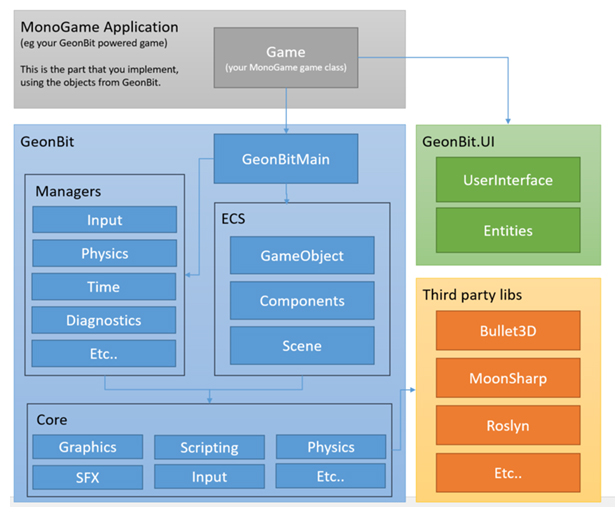

# GeonBit Overview

This section provides a broad overview of the layers of *GeonBit*. It's arranged from top down, eg from the highest-level APIs to the lower-level "drivers".



## GeonBitMain

A singleton class that reside directly under the *GeonBit* namespace, and provide the main API to initialize and run the *GeonBit* engine.

You can use this class in two ways:

1. Implement a GeonBitGame class and call ```GeonBitMain.Instance.Run()``` to execute it.
2. Create your own *MonoGame* ```Game``` class, and call ```Initialize()```, ```Update()``` and ```Draw()``` manually (less recommended method).


## GeonBitGame

A class that replace *MonoGame*'s ```Game``` class and integrates with *GeonBit*.
You should inherit from this class to implement your game logic and use ```GeonBitMain.Run()``` to start the game main loop.


## Resources

Instead of the default *MonoGame* Content class, in *GeonBit* you use the Resources Manager. 
When implementing a custom component or GeonBitGame class, the resources manager is easily accessible via the ```Resources``` getter.


## GeonBit.Managers

The ```Managers``` layer is a collection of singleton classes, which provide API and utilities for things like input, game-time, diagnostics, physics, filesystem, etc.

These classes are accessible by the game components and scripts you write.


## GeonBit.UI

This layer contain a variety of UI elements you can create and use, and a main ```User Interface``` manager that runs the UI engine.

Note that ```GeonBit.UI``` is also released as an external independent library you can use for other ```MonoGame``` projects, even if they don't use *GeonBit*. More details [here](https://github.com/RonenNess/GeonBit.UI).


## GeonBit.ECS

The namespace that contains all the Entity-Component-System related classes. 
The basic *GameObject* class is implemented in this layer, as well the *GameScene* and all the *Components* you can attach to objects.


## GeonBit.Core

The ```Core``` layer provide the actual implementation of the different built-in components and engine components. 

For example, a component to render a 3D model will not deal with ```MonoGame``` models directly, but instead will use an object implemented in the ```Core``` layer that will do all the dirty work.
The ```Core``` layer also implements the integration with some third-party libraries, like the ```Bullet3D``` Physics engine.

While most of the ```Core``` classes are public and can be accessed by your game, usually its best to stick to the ```ECS``` layer and reduce ```Core``` usage to minumum. 


## External Libs

In addition to *MonoGame*, *GeonBit* uses some external libraries to implement different components of the engine, like ```Bullet3D``` for physics. 

These libs are used by the ```Core``` layer and you should not use them directly. Just know its there.

