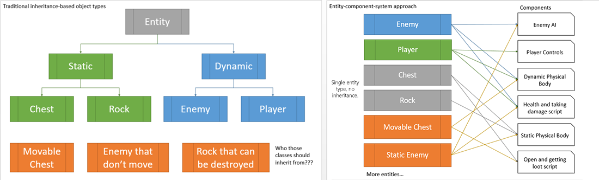

# Intro

GeonBit is an extensive Entity-Component based game engine, written in ```C#``` and powered by ```MonoGame```.


## What's ECS

From [Wikipedia](https://en.wikipedia.org/wiki/Entity%E2%80%93component%E2%80%93system):

> Entity-component system (ECS) is an architectural pattern that is mostly used in game development. 
> 
> An ECS follows the Composition over inheritance principle that allows greater flexibility in defining entities where every object in a game's scene is an entity (e.g. enemies, bullets, vehicles, etc.). 
> 
> Every Entity consists of one or more components which add additional behavior or functionality. Therefore, the behavior of an entity can be changed at runtime by adding or removing components. This eliminates the ambiguity problems of deep and wide inheritance hierarchies that are difficult to understand, maintain and extend. Common ECS approaches are highly compatible and often combined with data oriented design techniques.

Or in short, GeonBit provide a system of generic Game Objects to which you can attach / detach components. These are the building-blocks of your game.
In addition to the ECS system and framework, GeonBit also comes with a large set of built-in components, that make things like drawing, animating and physics a breeze.





## Key Features

In addition to its built-in ECS framework, *GeonBit* provide the following features / classes:


- UI
- - GeonBit.UI v3.x
- Managers
- - Application
- - ConfigStorage
- - Diagnostics
- - GameFiles
- - GameInput
- - Graphics
- - Plugins
- - Prototypes
- - Sounds
- - GameTime
- Graphics
- - Background
- - Skybox
- - Models
- - Skinned Models
- - Composite Models
- - Combined Meshes
- - Managed lights & lit materials
- - Billboard
- - Sprite
- - Shapes
- Resources Manager
- Misc
- - TileMap
- - Editor Controller
- - Time To Live
- Particles System
- - CPU Particles
- - Animators
- Physics
- - All basic collision shapes
- - Height maps
- - Convex / hull shapes
- - Compound collision shapes
- - Rigid Body
- - Kinematic Body
- - Static Body
- - Collision groups & filters
- - Collision events
- - Ethereal objects
- - Raytesting
- Sound
- - Sound effects
- - 3D sounds
- - Background music

In short, GeonBit comes with everything you need to make a basic 3D game, fast and easy!

For more complicated stuff (for example, if you build a multiplayer game and need networking components), *GeonBit* is open source and easy to extend. So you can easily write your own components and integrate them into the existing ECS framework.

