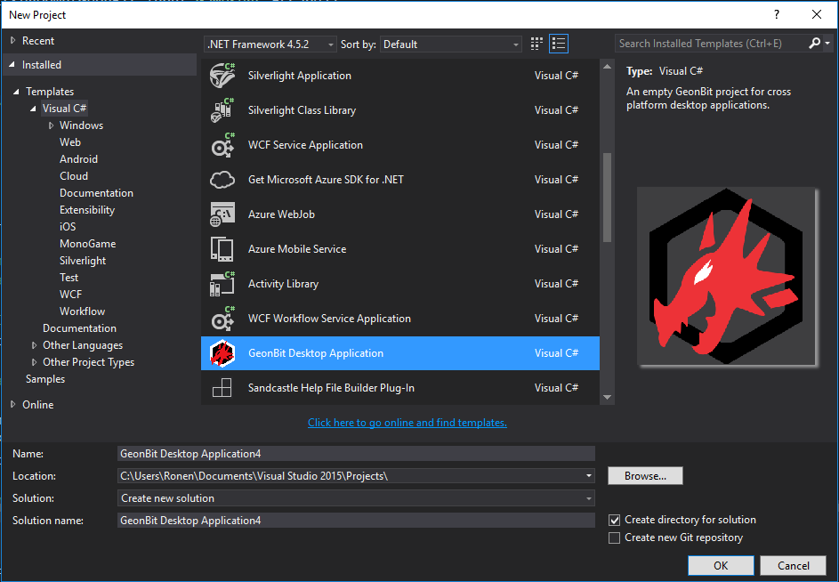
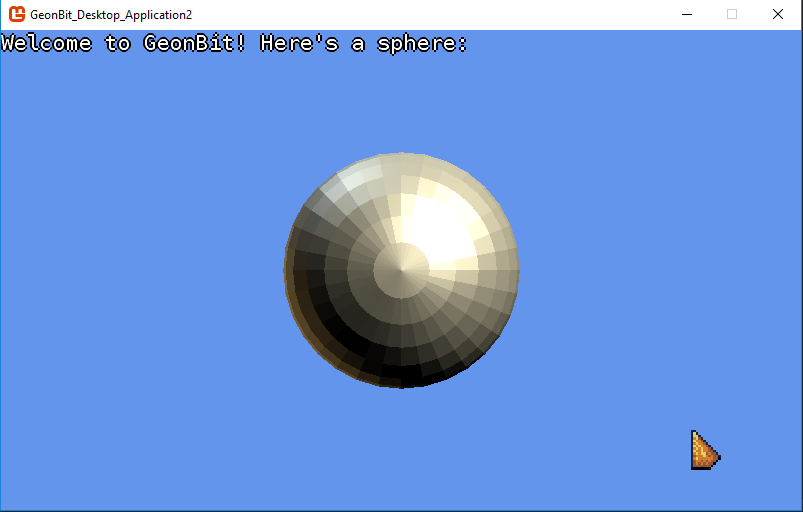

# Setup


*GeonBit* requires some unique init code and built-in content. 
Because of that, the best way to setup *GeonBit* is to use the provided ```Visual Studio``` template.

To use GeonBit template, follow these steps:

1. Download GeonBit's template [from here](https://github.com/RonenNess/GeonBit/raw/master/Template/GeonBit%20Desktop%20Application.zip) (or take the zip file from ```Template/``` folder).
2. Install it on Visual Studio (most simple way is to copy it to VS templates folder, for example: ```C:\Users\<USERNAME>\Documents\Visual Studio 2015\Templates\ProjectTemplates```).
3. Create a new project from the GeonBit template.

**Important:** When you create a new project from the GeonBit template, please create it in Visual Studio's default project's folder (for example ```C:\Users\<USERNAME>\Documents\Visual Studio 2015\Projects\```), otherwise some of the project settings may not be configured properly.
This is due to a really strange bug with VS / MonoGame templates which I have yet to solved. But don't worry, once project is created in the right folder, you can move it anywhere you like and it will work.



### That's it!

When executing the new project, you should see something like this:



